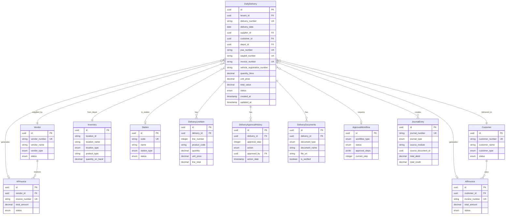

# Daily Delivery Database Schema Design
## Ghana OMC ERP System

### Executive Summary

This document presents the comprehensive database schema design for the Daily Delivery system, fully integrated with the existing Ghana OMC ERP architecture. The design ensures seamless conversion to supplier invoices (Accounts Payable) and customer invoices (Accounts Receivable), while maintaining Ghana-specific compliance requirements.

---

## 1. Core Daily Delivery Entity

### 1.1 DailyDelivery Entity

```typescript
import {
  Entity,
  PrimaryGeneratedColumn,
  Column,
  CreateDateColumn,
  UpdateDateColumn,
  Index,
  ManyToOne,
  OneToMany,
  JoinColumn,
  BeforeInsert,
  BeforeUpdate,
} from 'typeorm';

export enum DeliveryStatus {
  DRAFT = 'DRAFT',
  PENDING_APPROVAL = 'PENDING_APPROVAL',
  APPROVED = 'APPROVED',
  IN_TRANSIT = 'IN_TRANSIT',
  DELIVERED = 'DELIVERED',
  INVOICED_SUPPLIER = 'INVOICED_SUPPLIER',
  INVOICED_CUSTOMER = 'INVOICED_CUSTOMER',
  COMPLETED = 'COMPLETED',
  CANCELLED = 'CANCELLED',
  REJECTED = 'REJECTED'
}

export enum DeliveryType {
  DEPOT_TO_STATION = 'DEPOT_TO_STATION',
  DEPOT_TO_CUSTOMER = 'DEPOT_TO_CUSTOMER',
  INTER_DEPOT = 'INTER_DEPOT',
  CUSTOMER_PICKUP = 'CUSTOMER_PICKUP',
  EMERGENCY_DELIVERY = 'EMERGENCY_DELIVERY'
}

export enum ProductGrade {
  PMS = 'PMS', // Premium Motor Spirit
  AGO = 'AGO', // Automotive Gas Oil
  IFO = 'IFO', // Industrial Fuel Oil
  LPG = 'LPG', // Liquefied Petroleum Gas
  KEROSENE = 'KEROSENE',
  LUBRICANTS = 'LUBRICANTS'
}

@Entity('daily_deliveries')
@Index(['tenantId', 'deliveryDate'])
@Index(['tenantId', 'status'])
@Index(['tenantId', 'supplierId'])
@Index(['tenantId', 'customerId'])
@Index(['tenantId', 'depotId'])
@Index(['psaNumber'], { unique: true })
@Index(['waybillNumber'], { unique: true })
@Index(['invoiceNumber'], { unique: true, where: 'invoice_number IS NOT NULL' })
export class DailyDelivery {
  @PrimaryGeneratedColumn('uuid')
  id: string;

  @Column({ name: 'tenant_id', type: 'uuid' })
  tenantId: string;

  @Column({ name: 'delivery_number', length: 50, unique: true })
  deliveryNumber: string;

  // Core Required Fields
  @Column({ name: 'delivery_date', type: 'date' })
  @Index()
  deliveryDate: Date;

  @Column({ name: 'supplier_id', type: 'uuid' })
  supplierId: string;

  @Column({ name: 'depot_id', type: 'uuid' })
  depotId: string;

  @Column({ name: 'customer_id', type: 'uuid' })
  customerId: string;

  @Column({ name: 'customer_name', length: 255 })
  customerName: string;

  @Column({ name: 'delivery_location', type: 'text' })
  deliveryLocation: string;

  @Column({ name: 'psa_number', length: 50, unique: true })
  psaNumber: string; // Petroleum Supply Agreement Number

  @Column({ name: 'waybill_number', length: 50, unique: true })
  waybillNumber: string;

  @Column({ name: 'invoice_number', length: 50, nullable: true, unique: true })
  invoiceNumber: string;

  @Column({ name: 'vehicle_registration_number', length: 20 })
  vehicleRegistrationNumber: string;

  @Column({ name: 'transporter_id', type: 'uuid', nullable: true })
  transporterId: string;

  @Column({ name: 'transporter_name', length: 255 })
  transporterName: string;

  // Product Information
  @Column({ name: 'product_type', type: 'enum', enum: ProductGrade })
  productType: ProductGrade;

  @Column({ name: 'product_description', length: 255 })
  productDescription: string;

  @Column({ name: 'quantity_litres', type: 'decimal', precision: 15, scale: 2 })
  quantityLitres: number;

  @Column({ name: 'unit_price', type: 'decimal', precision: 15, scale: 4 })
  unitPrice: number;

  @Column({ name: 'total_value', type: 'decimal', precision: 15, scale: 2 })
  totalValue: number;

  @Column({ name: 'currency', length: 3, default: 'GHS' })
  currency: string;

  // Delivery Details
  @Column({ name: 'delivery_type', type: 'enum', enum: DeliveryType })
  deliveryType: DeliveryType;

  @Column({ name: 'loading_terminal', length: 255, nullable: true })
  loadingTerminal: string;

  @Column({ name: 'discharge_terminal', length: 255, nullable: true })
  dischargeTerminal: string;

  @Column({ name: 'planned_delivery_time', type: 'timestamp', nullable: true })
  plannedDeliveryTime: Date;

  @Column({ name: 'actual_delivery_time', type: 'timestamp', nullable: true })
  actualDeliveryTime: Date;

  @Column({ name: 'loading_start_time', type: 'timestamp', nullable: true })
  loadingStartTime: Date;

  @Column({ name: 'loading_end_time', type: 'timestamp', nullable: true })
  loadingEndTime: Date;

  @Column({ name: 'discharge_start_time', type: 'timestamp', nullable: true })
  dischargeStartTime: Date;

  @Column({ name: 'discharge_end_time', type: 'timestamp', nullable: true })
  dischargeEndTime: Date;

  // Quality Control
  @Column({ name: 'temperature_at_loading', type: 'decimal', precision: 5, scale: 2, nullable: true })
  temperatureAtLoading: number;

  @Column({ name: 'temperature_at_discharge', type: 'decimal', precision: 5, scale: 2, nullable: true })
  temperatureAtDischarge: number;

  @Column({ name: 'density_at_loading', type: 'decimal', precision: 8, scale: 4, nullable: true })
  densityAtLoading: number;

  @Column({ name: 'density_at_discharge', type: 'decimal', precision: 8, scale: 4, nullable: true })
  densityAtDischarge: number;

  @Column({ name: 'net_standard_volume', type: 'decimal', precision: 15, scale: 2, nullable: true })
  netStandardVolume: number;

  @Column({ name: 'gross_standard_volume', type: 'decimal', precision: 15, scale: 2, nullable: true })
  grossStandardVolume: number;

  @Column({ name: 'volume_correction_factor', type: 'decimal', precision: 8, scale: 6, nullable: true })
  volumeCorrectionFactor: number;

  // Tank Information
  @Column({ name: 'source_tank_number', length: 50, nullable: true })
  sourceTankNumber: string;

  @Column({ name: 'destination_tank_number', length: 50, nullable: true })
  destinationTankNumber: string;

  @Column({ name: 'compartment_numbers', type: 'text', nullable: true })
  compartmentNumbers: string; // JSON array

  @Column({ name: 'seal_numbers', type: 'text', nullable: true })
  sealNumbers: string; // JSON array

  // Driver Information
  @Column({ name: 'driver_id', type: 'uuid', nullable: true })
  driverId: string;

  @Column({ name: 'driver_name', length: 255, nullable: true })
  driverName: string;

  @Column({ name: 'driver_license_number', length: 50, nullable: true })
  driverLicenseNumber: string;

  @Column({ name: 'driver_phone', length: 20, nullable: true })
  driverPhone: string;

  // Financial Integration
  @Column({ name: 'supplier_invoice_id', type: 'uuid', nullable: true })
  supplierInvoiceId: string;

  @Column({ name: 'customer_invoice_id', type: 'uuid', nullable: true })
  customerInvoiceId: string;

  @Column({ name: 'supplier_invoice_number', length: 50, nullable: true })
  supplierInvoiceNumber: string;

  @Column({ name: 'customer_invoice_number', length: 50, nullable: true })
  customerInvoiceNumber: string;

  @Column({ name: 'purchase_order_id', type: 'uuid', nullable: true })
  purchaseOrderId: string;

  @Column({ name: 'purchase_order_number', length: 50, nullable: true })
  purchaseOrderNumber: string;

  @Column({ name: 'sales_order_id', type: 'uuid', nullable: true })
  salesOrderId: string;

  @Column({ name: 'sales_order_number', length: 50, nullable: true })
  salesOrderNumber: string;

  // Status and Approval
  @Column({ name: 'status', type: 'enum', enum: DeliveryStatus, default: DeliveryStatus.DRAFT })
  @Index()
  status: DeliveryStatus;

  @Column({ name: 'approval_workflow_id', type: 'uuid', nullable: true })
  approvalWorkflowId: string;

  @Column({ name: 'approved_by', type: 'uuid', nullable: true })
  approvedBy: string;

  @Column({ name: 'approval_date', type: 'timestamp', nullable: true })
  approvalDate: Date;

  @Column({ name: 'approval_comments', type: 'text', nullable: true })
  approvalComments: string;

  // Ghana Compliance
  @Column({ name: 'npa_permit_number', length: 50, nullable: true })
  npaPermitNumber: string;

  @Column({ name: 'customs_entry_number', length: 50, nullable: true })
  customsEntryNumber: string;

  @Column({ name: 'customs_duty_paid', type: 'decimal', precision: 15, scale: 2, default: 0 })
  customsDutyPaid: number;

  @Column({ name: 'petroleum_tax_amount', type: 'decimal', precision: 15, scale: 2, default: 0 })
  petroleumTaxAmount: number;

  @Column({ name: 'energy_fund_levy', type: 'decimal', precision: 15, scale: 2, default: 0 })
  energyFundLevy: number;

  @Column({ name: 'road_fund_levy', type: 'decimal', precision: 15, scale: 2, default: 0 })
  roadFundLevy: number;

  @Column({ name: 'price_stabilization_levy', type: 'decimal', precision: 15, scale: 2, default: 0 })
  priceStabilizationLevy: number;

  @Column({ name: 'primary_distribution_margin', type: 'decimal', precision: 15, scale: 2, default: 0 })
  primaryDistributionMargin: number;

  @Column({ name: 'marketing_margin', type: 'decimal', precision: 15, scale: 2, default: 0 })
  marketingMargin: number;

  @Column({ name: 'dealer_margin', type: 'decimal', precision: 15, scale: 2, default: 0 })
  dealerMargin: number;

  @Column({ name: 'unified_petroleum_price_fund_levy', type: 'decimal', precision: 15, scale: 2, default: 0 })
  unifiedPetroleumPriceFundLevy: number;

  // GPS and Tracking
  @Column({ name: 'gps_tracking_enabled', type: 'boolean', default: false })
  gpsTrackingEnabled: boolean;

  @Column({ name: 'route_coordinates', type: 'text', nullable: true })
  routeCoordinates: string; // JSON array of GPS coordinates

  @Column({ name: 'distance_travelled_km', type: 'decimal', precision: 8, scale: 2, nullable: true })
  distanceTravelledKm: number;

  @Column({ name: 'fuel_consumption_litres', type: 'decimal', precision: 10, scale: 2, nullable: true })
  fuelConsumptionLitres: number;

  @Column({ name: 'route_deviation_flag', type: 'boolean', default: false })
  routeDeviationFlag: boolean;

  @Column({ name: 'unauthorized_stops', type: 'text', nullable: true })
  unauthorizedStops: string; // JSON array

  // Risk and Insurance
  @Column({ name: 'insurance_policy_number', length: 100, nullable: true })
  insurancePolicyNumber: string;

  @Column({ name: 'insurance_coverage_amount', type: 'decimal', precision: 15, scale: 2, nullable: true })
  insuranceCoverageAmount: number;

  @Column({ name: 'risk_assessment_score', type: 'integer', default: 1 })
  riskAssessmentScore: number; // 1-10

  @Column({ name: 'security_escort_required', type: 'boolean', default: false })
  securityEscortRequired: boolean;

  @Column({ name: 'security_escort_details', type: 'text', nullable: true })
  securityEscortDetails: string;

  // Environmental Compliance
  @Column({ name: 'environmental_permit_number', length: 50, nullable: true })
  environmentalPermitNumber: string;

  @Column({ name: 'emission_certificate_number', length: 50, nullable: true })
  emissionCertificateNumber: string;

  @Column({ name: 'carbon_footprint_kg', type: 'decimal', precision: 10, scale: 2, nullable: true })
  carbonFootprintKg: number;

  // IFRS Compliance
  @Column({ name: 'revenue_recognition_date', type: 'date', nullable: true })
  revenueRecognitionDate: Date;

  @Column({ name: 'revenue_recognition_amount', type: 'decimal', precision: 15, scale: 2, nullable: true })
  revenueRecognitionAmount: number;

  @Column({ name: 'contract_asset_amount', type: 'decimal', precision: 15, scale: 2, default: 0 })
  contractAssetAmount: number;

  @Column({ name: 'contract_liability_amount', type: 'decimal', precision: 15, scale: 2, default: 0 })
  contractLiabilityAmount: number;

  @Column({ name: 'performance_obligation_satisfied', type: 'boolean', default: false })
  performanceObligationSatisfied: boolean;

  // Document Management
  @Column({ name: 'delivery_receipt_url', type: 'text', nullable: true })
  deliveryReceiptUrl: string;

  @Column({ name: 'bill_of_lading_url', type: 'text', nullable: true })
  billOfLadingUrl: string;

  @Column({ name: 'quality_certificate_url', type: 'text', nullable: true })
  qualityCertificateUrl: string;

  @Column({ name: 'customs_documents_url', type: 'text', nullable: true })
  customsDocumentsUrl: string;

  @Column({ name: 'supporting_documents', type: 'text', nullable: true })
  supportingDocuments: string; // JSON array of document URLs

  // Additional Information
  @Column({ name: 'delivery_instructions', type: 'text', nullable: true })
  deliveryInstructions: string;

  @Column({ name: 'special_handling_requirements', type: 'text', nullable: true })
  specialHandlingRequirements: string;

  @Column({ name: 'remarks', type: 'text', nullable: true })
  remarks: string;

  @Column({ name: 'internal_notes', type: 'text', nullable: true })
  internalNotes: string;

  @Column({ name: 'customer_feedback', type: 'text', nullable: true })
  customerFeedback: string;

  @Column({ name: 'delivery_rating', type: 'integer', nullable: true })
  deliveryRating: number; // 1-5 stars

  // System Fields
  @Column({ name: 'is_active', type: 'boolean', default: true })
  isActive: boolean;

  @Column({ name: 'sync_status', length: 20, default: 'SYNCED' })
  syncStatus: string;

  @Column({ name: 'last_sync_date', type: 'timestamp', nullable: true })
  lastSyncDate: Date;

  @Column({ name: 'external_reference_id', length: 100, nullable: true })
  externalReferenceId: string;

  @Column({ name: 'integration_flags', type: 'text', nullable: true })
  integrationFlags: string; // JSON object

  // Audit Fields
  @Column({ name: 'created_by', type: 'uuid' })
  createdBy: string;

  @Column({ name: 'updated_by', type: 'uuid', nullable: true })
  updatedBy: string;

  @CreateDateColumn({ name: 'created_at' })
  createdAt: Date;

  @UpdateDateColumn({ name: 'updated_at' })
  updatedAt: Date;

  // Lifecycle hooks
  @BeforeInsert()
  generateDeliveryNumber() {
    if (!this.deliveryNumber) {
      const date = new Date().toISOString().slice(0, 10).replace(/-/g, '');
      const random = Math.random().toString(36).substring(2, 8).toUpperCase();
      this.deliveryNumber = `DD-${date}-${random}`;
    }
  }

  @BeforeInsert()
  @BeforeUpdate()
  calculateTotals() {
    this.totalValue = this.quantityLitres * this.unitPrice;
    
    // Calculate net standard volume if temperature and density are provided
    if (this.temperatureAtLoading && this.densityAtLoading) {
      this.volumeCorrectionFactor = this.calculateVCF(this.temperatureAtLoading, this.densityAtLoading);
      this.netStandardVolume = this.quantityLitres * this.volumeCorrectionFactor;
    }
  }

  // Helper methods
  private calculateVCF(temperature: number, density: number): number {
    // Simplified VCF calculation - in reality, this would use API standards
    const baseTemp = 15; // Standard temperature in Celsius
    const expansionCoefficient = 0.0008; // Typical for petroleum products
    return 1 - (temperature - baseTemp) * expansionCoefficient;
  }

  // Business logic methods
  canBeApproved(): boolean {
    return this.status === DeliveryStatus.PENDING_APPROVAL && 
           this.quantityLitres > 0 && 
           this.unitPrice > 0 &&
           this.psaNumber && 
           this.waybillNumber;
  }

  canBeInvoicedToSupplier(): boolean {
    return this.status === DeliveryStatus.DELIVERED && 
           !this.supplierInvoiceId &&
           this.performanceObligationSatisfied;
  }

  canBeInvoicedToCustomer(): boolean {
    return this.status === DeliveryStatus.DELIVERED && 
           !this.customerInvoiceId &&
           this.actualDeliveryTime;
  }

  getTotalTaxes(): number {
    return this.petroleumTaxAmount + 
           this.energyFundLevy + 
           this.roadFundLevy + 
           this.priceStabilizationLevy + 
           this.unifiedPetroleumPriceFundLevy;
  }

  getTotalMargins(): number {
    return this.primaryDistributionMargin + 
           this.marketingMargin + 
           this.dealerMargin;
  }

  getDeliveryDurationHours(): number {
    if (this.loadingStartTime && this.dischargeEndTime) {
      return (this.dischargeEndTime.getTime() - this.loadingStartTime.getTime()) / (1000 * 60 * 60);
    }
    return 0;
  }

  isDelayed(): boolean {
    if (this.plannedDeliveryTime && this.actualDeliveryTime) {
      return this.actualDeliveryTime > this.plannedDeliveryTime;
    }
    return false;
  }

  getDelayHours(): number {
    if (this.isDelayed()) {
      return (this.actualDeliveryTime.getTime() - this.plannedDeliveryTime.getTime()) / (1000 * 60 * 60);
    }
    return 0;
  }
}
```

---

## 2. Supporting Entities

### 2.1 DeliveryLineItem Entity

```typescript
import {
  Entity,
  PrimaryGeneratedColumn,
  Column,
  ManyToOne,
  JoinColumn,
  Index,
} from 'typeorm';
import { DailyDelivery } from './daily-delivery.entity';

@Entity('delivery_line_items')
@Index(['deliveryId'])
export class DeliveryLineItem {
  @PrimaryGeneratedColumn('uuid')
  id: string;

  @Column({ name: 'delivery_id', type: 'uuid' })
  deliveryId: string;

  @Column({ name: 'line_number', type: 'integer' })
  lineNumber: number;

  @Column({ name: 'product_code', length: 50 })
  productCode: string;

  @Column({ name: 'product_name', length: 255 })
  productName: string;

  @Column({ name: 'product_grade', type: 'enum', enum: ProductGrade })
  productGrade: ProductGrade;

  @Column({ name: 'quantity', type: 'decimal', precision: 15, scale: 2 })
  quantity: number;

  @Column({ name: 'unit_price', type: 'decimal', precision: 15, scale: 4 })
  unitPrice: number;

  @Column({ name: 'line_total', type: 'decimal', precision: 15, scale: 2 })
  lineTotal: number;

  @Column({ name: 'tank_number', length: 50, nullable: true })
  tankNumber: string;

  @Column({ name: 'compartment_number', length: 50, nullable: true })
  compartmentNumber: string;

  @Column({ name: 'batch_number', length: 100, nullable: true })
  batchNumber: string;

  @Column({ name: 'quality_specifications', type: 'text', nullable: true })
  qualitySpecifications: string; // JSON

  @ManyToOne(() => DailyDelivery, delivery => delivery.lineItems)
  @JoinColumn({ name: 'delivery_id' })
  delivery: DailyDelivery;
}
```

### 2.2 DeliveryApprovalHistory Entity

```typescript
import {
  Entity,
  PrimaryGeneratedColumn,
  Column,
  CreateDateColumn,
  ManyToOne,
  JoinColumn,
  Index,
} from 'typeorm';
import { DailyDelivery } from './daily-delivery.entity';

export enum ApprovalAction {
  SUBMITTED = 'SUBMITTED',
  APPROVED = 'APPROVED',
  REJECTED = 'REJECTED',
  RETURNED = 'RETURNED',
  CANCELLED = 'CANCELLED',
  ESCALATED = 'ESCALATED'
}

@Entity('delivery_approval_history')
@Index(['deliveryId'])
@Index(['approvedBy'])
export class DeliveryApprovalHistory {
  @PrimaryGeneratedColumn('uuid')
  id: string;

  @Column({ name: 'delivery_id', type: 'uuid' })
  deliveryId: string;

  @Column({ name: 'approval_step', type: 'integer' })
  approvalStep: number;

  @Column({ name: 'action', type: 'enum', enum: ApprovalAction })
  action: ApprovalAction;

  @Column({ name: 'approved_by', type: 'uuid' })
  approvedBy: string;

  @Column({ name: 'approver_role', length: 100 })
  approverRole: string;

  @Column({ name: 'comments', type: 'text', nullable: true })
  comments: string;

  @Column({ name: 'decision_deadline', type: 'timestamp', nullable: true })
  decisionDeadline: Date;

  @Column({ name: 'escalation_flag', type: 'boolean', default: false })
  escalationFlag: boolean;

  @CreateDateColumn({ name: 'action_date' })
  actionDate: Date;

  @ManyToOne(() => DailyDelivery, delivery => delivery.approvalHistory)
  @JoinColumn({ name: 'delivery_id' })
  delivery: DailyDelivery;
}
```

### 2.3 DeliveryDocuments Entity

```typescript
import {
  Entity,
  PrimaryGeneratedColumn,
  Column,
  CreateDateColumn,
  ManyToOne,
  JoinColumn,
  Index,
} from 'typeorm';
import { DailyDelivery } from './daily-delivery.entity';

export enum DocumentType {
  DELIVERY_RECEIPT = 'DELIVERY_RECEIPT',
  BILL_OF_LADING = 'BILL_OF_LADING',
  QUALITY_CERTIFICATE = 'QUALITY_CERTIFICATE',
  CUSTOMS_DOCUMENT = 'CUSTOMS_DOCUMENT',
  INSURANCE_CERTIFICATE = 'INSURANCE_CERTIFICATE',
  ENVIRONMENTAL_PERMIT = 'ENVIRONMENTAL_PERMIT',
  SAFETY_CERTIFICATE = 'SAFETY_CERTIFICATE',
  WAYBILL = 'WAYBILL',
  INVOICE_COPY = 'INVOICE_COPY',
  OTHER = 'OTHER'
}

@Entity('delivery_documents')
@Index(['deliveryId'])
@Index(['documentType'])
export class DeliveryDocuments {
  @PrimaryGeneratedColumn('uuid')
  id: string;

  @Column({ name: 'delivery_id', type: 'uuid' })
  deliveryId: string;

  @Column({ name: 'document_type', type: 'enum', enum: DocumentType })
  documentType: DocumentType;

  @Column({ name: 'document_name', length: 255 })
  documentName: string;

  @Column({ name: 'document_number', length: 100, nullable: true })
  documentNumber: string;

  @Column({ name: 'file_url', type: 'text' })
  fileUrl: string;

  @Column({ name: 'file_size_bytes', type: 'bigint', nullable: true })
  fileSizeBytes: number;

  @Column({ name: 'mime_type', length: 100, nullable: true })
  mimeType: string;

  @Column({ name: 'is_required', type: 'boolean', default: false })
  isRequired: boolean;

  @Column({ name: 'is_verified', type: 'boolean', default: false })
  isVerified: boolean;

  @Column({ name: 'verified_by', type: 'uuid', nullable: true })
  verifiedBy: string;

  @Column({ name: 'verification_date', type: 'timestamp', nullable: true })
  verificationDate: Date;

  @Column({ name: 'uploaded_by', type: 'uuid' })
  uploadedBy: string;

  @CreateDateColumn({ name: 'uploaded_at' })
  uploadedAt: Date;

  @ManyToOne(() => DailyDelivery, delivery => delivery.documents)
  @JoinColumn({ name: 'delivery_id' })
  delivery: DailyDelivery;
}
```

---

## 3. Integration Points with Existing Models

### 3.1 Relationships with Core Entities

```typescript
// Add to DailyDelivery entity

// Relationships with existing entities
@ManyToOne(() => Vendor, vendor => vendor.deliveries)
@JoinColumn({ name: 'supplier_id' })
supplier: Vendor;

@ManyToOne(() => Customer, customer => customer.deliveries)
@JoinColumn({ name: 'customer_id' })
customer: Customer;

@ManyToOne(() => Inventory, inventory => inventory.deliveries)
@JoinColumn({ name: 'depot_id' })
depot: Inventory;

@ManyToOne(() => Station, station => station.deliveries)
@JoinColumn({ name: 'destination_station_id' })
destinationStation: Station;

@ManyToOne(() => APInvoice, invoice => invoice.deliveries)
@JoinColumn({ name: 'supplier_invoice_id' })
supplierInvoice: APInvoice;

@ManyToOne(() => ARInvoice, invoice => invoice.deliveries)
@JoinColumn({ name: 'customer_invoice_id' })
customerInvoice: ARInvoice;

@ManyToOne(() => ApprovalWorkflow, workflow => workflow.deliveries)
@JoinColumn({ name: 'approval_workflow_id' })
approvalWorkflow: ApprovalWorkflow;

@OneToMany(() => DeliveryLineItem, lineItem => lineItem.delivery, { cascade: true })
lineItems: DeliveryLineItem[];

@OneToMany(() => DeliveryApprovalHistory, approval => approval.delivery, { cascade: true })
approvalHistory: DeliveryApprovalHistory[];

@OneToMany(() => DeliveryDocuments, document => document.delivery, { cascade: true })
documents: DeliveryDocuments[];

@OneToMany(() => JournalEntry, journalEntry => journalEntry.sourceDelivery)
journalEntries: JournalEntry[];
```

### 3.2 Extensions to Existing Entities

```typescript
// Add to Customer.entity.ts
@OneToMany(() => DailyDelivery, delivery => delivery.customer)
deliveries: DailyDelivery[];

// Add to Vendor.entity.ts
@OneToMany(() => DailyDelivery, delivery => delivery.supplier)
deliveries: DailyDelivery[];

// Add to Inventory.entity.ts
@OneToMany(() => DailyDelivery, delivery => delivery.depot)
deliveries: DailyDelivery[];

// Add to Station.entity.ts
@OneToMany(() => DailyDelivery, delivery => delivery.destinationStation)
deliveries: DailyDelivery[];

// Add to JournalEntry.entity.ts
@Column({ name: 'source_delivery_id', type: 'uuid', nullable: true })
sourceDeliveryId: string;

@ManyToOne(() => DailyDelivery, delivery => delivery.journalEntries)
@JoinColumn({ name: 'source_delivery_id' })
sourceDelivery: DailyDelivery;
```

---

## 4. Approval Workflow States

### 4.1 Workflow Configuration

```typescript
export interface DeliveryApprovalMatrix {
  workflow_name: string;
  delivery_type: DeliveryType;
  amount_threshold: number;
  risk_level: 'LOW' | 'MEDIUM' | 'HIGH' | 'CRITICAL';
  approval_steps: Array<{
    step_number: number;
    role: string;
    required_approvals: number;
    timeout_hours: number;
    conditions: {
      amount_range?: { min: number; max: number };
      product_types?: ProductGrade[];
      customer_types?: string[];
      supplier_types?: string[];
      special_requirements?: string[];
    };
  }>;
}

// Example approval matrix
export const DELIVERY_APPROVAL_MATRICES: DeliveryApprovalMatrix[] = [
  {
    workflow_name: 'Standard Delivery Approval',
    delivery_type: DeliveryType.DEPOT_TO_STATION,
    amount_threshold: 100000, // GHS
    risk_level: 'LOW',
    approval_steps: [
      {
        step_number: 1,
        role: 'DEPOT_SUPERVISOR',
        required_approvals: 1,
        timeout_hours: 2,
        conditions: {
          amount_range: { min: 0, max: 50000 }
        }
      },
      {
        step_number: 2,
        role: 'OPERATIONS_MANAGER',
        required_approvals: 1,
        timeout_hours: 4,
        conditions: {
          amount_range: { min: 50001, max: 100000 }
        }
      }
    ]
  },
  {
    workflow_name: 'High Value Delivery Approval',
    delivery_type: DeliveryType.DEPOT_TO_CUSTOMER,
    amount_threshold: 500000,
    risk_level: 'HIGH',
    approval_steps: [
      {
        step_number: 1,
        role: 'OPERATIONS_MANAGER',
        required_approvals: 1,
        timeout_hours: 4,
        conditions: {}
      },
      {
        step_number: 2,
        role: 'FINANCE_MANAGER',
        required_approvals: 1,
        timeout_hours: 8,
        conditions: {}
      },
      {
        step_number: 3,
        role: 'GENERAL_MANAGER',
        required_approvals: 1,
        timeout_hours: 24,
        conditions: {
          amount_range: { min: 500000, max: Number.MAX_VALUE }
        }
      }
    ]
  }
];
```

### 4.2 Status Transitions

```typescript
export class DeliveryStatusTransitions {
  private static readonly VALID_TRANSITIONS: Record<DeliveryStatus, DeliveryStatus[]> = {
    [DeliveryStatus.DRAFT]: [
      DeliveryStatus.PENDING_APPROVAL,
      DeliveryStatus.CANCELLED
    ],
    [DeliveryStatus.PENDING_APPROVAL]: [
      DeliveryStatus.APPROVED,
      DeliveryStatus.REJECTED,
      DeliveryStatus.DRAFT,
      DeliveryStatus.CANCELLED
    ],
    [DeliveryStatus.APPROVED]: [
      DeliveryStatus.IN_TRANSIT,
      DeliveryStatus.CANCELLED
    ],
    [DeliveryStatus.IN_TRANSIT]: [
      DeliveryStatus.DELIVERED,
      DeliveryStatus.CANCELLED
    ],
    [DeliveryStatus.DELIVERED]: [
      DeliveryStatus.INVOICED_SUPPLIER,
      DeliveryStatus.INVOICED_CUSTOMER,
      DeliveryStatus.COMPLETED
    ],
    [DeliveryStatus.INVOICED_SUPPLIER]: [
      DeliveryStatus.INVOICED_CUSTOMER,
      DeliveryStatus.COMPLETED
    ],
    [DeliveryStatus.INVOICED_CUSTOMER]: [
      DeliveryStatus.COMPLETED
    ],
    [DeliveryStatus.COMPLETED]: [],
    [DeliveryStatus.CANCELLED]: [],
    [DeliveryStatus.REJECTED]: [
      DeliveryStatus.DRAFT,
      DeliveryStatus.CANCELLED
    ]
  };

  static canTransition(from: DeliveryStatus, to: DeliveryStatus): boolean {
    return this.VALID_TRANSITIONS[from]?.includes(to) || false;
  }

  static getValidTransitions(status: DeliveryStatus): DeliveryStatus[] {
    return this.VALID_TRANSITIONS[status] || [];
  }
}
```

---

## 5. Validation Rules and Constraints

### 5.1 Database Constraints

```sql
-- Daily Delivery Constraints
ALTER TABLE daily_deliveries 
ADD CONSTRAINT chk_quantity_positive 
CHECK (quantity_litres > 0);

ALTER TABLE daily_deliveries 
ADD CONSTRAINT chk_unit_price_positive 
CHECK (unit_price > 0);

ALTER TABLE daily_deliveries 
ADD CONSTRAINT chk_total_value_positive 
CHECK (total_value > 0);

ALTER TABLE daily_deliveries 
ADD CONSTRAINT chk_delivery_date_not_future 
CHECK (delivery_date <= CURRENT_DATE);

ALTER TABLE daily_deliveries 
ADD CONSTRAINT chk_temperature_range 
CHECK (temperature_at_loading BETWEEN -50 AND 100 
   AND temperature_at_discharge BETWEEN -50 AND 100);

ALTER TABLE daily_deliveries 
ADD CONSTRAINT chk_density_range 
CHECK (density_at_loading BETWEEN 0.5 AND 1.5 
   AND density_at_discharge BETWEEN 0.5 AND 1.5);

-- Unique constraints for Ghana compliance
ALTER TABLE daily_deliveries 
ADD CONSTRAINT uk_psa_number_per_date 
UNIQUE (psa_number, delivery_date);

ALTER TABLE daily_deliveries 
ADD CONSTRAINT uk_waybill_number_per_date 
UNIQUE (waybill_number, delivery_date);

-- Status transition constraints
ALTER TABLE daily_deliveries 
ADD CONSTRAINT chk_approval_date_when_approved 
CHECK (
  (status = 'APPROVED' AND approval_date IS NOT NULL AND approved_by IS NOT NULL) 
  OR status != 'APPROVED'
);

ALTER TABLE daily_deliveries 
ADD CONSTRAINT chk_actual_delivery_when_delivered 
CHECK (
  (status IN ('DELIVERED', 'INVOICED_SUPPLIER', 'INVOICED_CUSTOMER', 'COMPLETED') 
   AND actual_delivery_time IS NOT NULL) 
  OR status NOT IN ('DELIVERED', 'INVOICED_SUPPLIER', 'INVOICED_CUSTOMER', 'COMPLETED')
);
```

### 5.2 Business Validation Rules

```typescript
export class DeliveryValidationRules {
  static validateDelivery(delivery: DailyDelivery): ValidationResult {
    const errors: string[] = [];
    const warnings: string[] = [];

    // Required fields validation
    if (!delivery.deliveryDate) errors.push('Delivery date is required');
    if (!delivery.supplierId) errors.push('Supplier is required');
    if (!delivery.customerId) errors.push('Customer is required');
    if (!delivery.depotId) errors.push('Depot is required');
    if (!delivery.psaNumber) errors.push('PSA number is required');
    if (!delivery.waybillNumber) errors.push('Waybill number is required');
    if (!delivery.vehicleRegistrationNumber) errors.push('Vehicle registration is required');

    // Quantity and pricing validation
    if (delivery.quantityLitres <= 0) errors.push('Quantity must be positive');
    if (delivery.unitPrice <= 0) errors.push('Unit price must be positive');
    if (Math.abs(delivery.totalValue - (delivery.quantityLitres * delivery.unitPrice)) > 0.01) {
      errors.push('Total value calculation mismatch');
    }

    // Ghana-specific validations
    if (delivery.productType === ProductGrade.PMS || delivery.productType === ProductGrade.AGO) {
      if (!delivery.npaPermitNumber) warnings.push('NPA permit number recommended for controlled products');
    }

    // Date validations
    if (delivery.deliveryDate > new Date()) {
      errors.push('Delivery date cannot be in the future');
    }

    if (delivery.plannedDeliveryTime && delivery.actualDeliveryTime) {
      if (delivery.actualDeliveryTime < delivery.plannedDeliveryTime) {
        warnings.push('Actual delivery time is before planned time');
      }
    }

    // Temperature and density validations
    if (delivery.temperatureAtLoading !== null) {
      if (delivery.temperatureAtLoading < -50 || delivery.temperatureAtLoading > 100) {
        errors.push('Loading temperature out of valid range (-50°C to 100°C)');
      }
    }

    if (delivery.densityAtLoading !== null) {
      if (delivery.densityAtLoading < 0.5 || delivery.densityAtLoading > 1.5) {
        errors.push('Loading density out of valid range (0.5 to 1.5 g/cm³)');
      }
    }

    // Volume validation
    if (delivery.netStandardVolume && delivery.grossStandardVolume) {
      if (delivery.netStandardVolume > delivery.grossStandardVolume) {
        warnings.push('Net standard volume exceeds gross standard volume');
      }
    }

    // Risk assessment validation
    if (delivery.quantityLitres > 50000 && !delivery.securityEscortRequired) {
      warnings.push('Security escort recommended for high-volume deliveries');
    }

    // Environmental validation
    if (delivery.carbonFootprintKg && delivery.distanceTravelledKm) {
      const expectedFootprint = delivery.distanceTravelledKm * 2.6; // kg CO2 per km for trucks
      if (Math.abs(delivery.carbonFootprintKg - expectedFootprint) > expectedFootprint * 0.2) {
        warnings.push('Carbon footprint calculation may be inaccurate');
      }
    }

    return {
      isValid: errors.length === 0,
      errors,
      warnings
    };
  }

  static validateForApproval(delivery: DailyDelivery): ValidationResult {
    const baseValidation = this.validateDelivery(delivery);
    const approvalErrors = [...baseValidation.errors];
    const approvalWarnings = [...baseValidation.warnings];

    // Additional approval-specific validations
    if (delivery.status !== DeliveryStatus.DRAFT) {
      approvalErrors.push('Only draft deliveries can be submitted for approval');
    }

    if (!delivery.deliveryInstructions && delivery.quantityLitres > 30000) {
      approvalWarnings.push('Delivery instructions recommended for large deliveries');
    }

    if (!delivery.insurancePolicyNumber && delivery.totalValue > 100000) {
      approvalErrors.push('Insurance policy required for high-value deliveries');
    }

    return {
      isValid: approvalErrors.length === 0,
      errors: approvalErrors,
      warnings: approvalWarnings
    };
  }

  static validateForInvoicing(delivery: DailyDelivery): ValidationResult {
    const errors: string[] = [];
    const warnings: string[] = [];

    if (delivery.status !== DeliveryStatus.DELIVERED) {
      errors.push('Only delivered items can be invoiced');
    }

    if (!delivery.actualDeliveryTime) {
      errors.push('Actual delivery time required for invoicing');
    }

    if (!delivery.performanceObligationSatisfied) {
      errors.push('Performance obligation must be satisfied before invoicing');
    }

    if (!delivery.deliveryReceiptUrl) {
      warnings.push('Delivery receipt recommended for invoicing');
    }

    if (delivery.netStandardVolume && Math.abs(delivery.quantityLitres - delivery.netStandardVolume) > delivery.quantityLitres * 0.02) {
      warnings.push('Significant volume variance detected - verify measurements');
    }

    return {
      isValid: errors.length === 0,
      errors,
      warnings
    };
  }
}

interface ValidationResult {
  isValid: boolean;
  errors: string[];
  warnings: string[];
}
```

---

## 6. Integration with Accounts Payable/Receivable

### 6.1 Supplier Invoice Generation

```typescript
export class SupplierInvoiceService {
  async generateSupplierInvoice(delivery: DailyDelivery): Promise<APInvoice> {
    // Validate delivery can be invoiced
    const validation = DeliveryValidationRules.validateForInvoicing(delivery);
    if (!validation.isValid) {
      throw new Error(`Cannot generate supplier invoice: ${validation.errors.join(', ')}`);
    }

    const invoice = new APInvoice();
    
    // Basic invoice information
    invoice.tenantId = delivery.tenantId;
    invoice.vendorId = delivery.supplierId;
    invoice.invoiceNumber = await this.generateInvoiceNumber('AP', delivery.deliveryDate);
    invoice.invoiceDate = delivery.actualDeliveryTime || delivery.deliveryDate;
    invoice.dueDate = this.calculateDueDate(invoice.invoiceDate, delivery.supplier.paymentTerms);
    invoice.currency = delivery.currency;
    
    // Reference delivery
    invoice.sourceDocumentType = 'DAILY_DELIVERY';
    invoice.sourceDocumentId = delivery.id;
    invoice.referenceNumber = delivery.deliveryNumber;
    
    // Calculate amounts
    invoice.subtotal = delivery.totalValue;
    invoice.taxAmount = delivery.getTotalTaxes();
    invoice.totalAmount = invoice.subtotal + invoice.taxAmount;
    invoice.amountDue = invoice.totalAmount;
    
    // Ghana-specific fields
    invoice.withholdingTaxAmount = this.calculateWithholdingTax(delivery);
    invoice.vatAmount = this.calculateVAT(delivery);
    invoice.customsDutyAmount = delivery.customsDutyPaid;
    
    // IFRS fields
    invoice.contractLiabilityAmount = delivery.contractLiabilityAmount;
    invoice.revenueRecognitionDate = delivery.revenueRecognitionDate;
    
    // Line items
    const lineItem = new APInvoiceLineItem();
    lineItem.lineNumber = 1;
    lineItem.description = `${delivery.productType} - ${delivery.quantityLitres}L delivered to ${delivery.customerName}`;
    lineItem.quantity = delivery.quantityLitres;
    lineItem.unitPrice = delivery.unitPrice;
    lineItem.lineTotal = delivery.totalValue;
    lineItem.accountCode = this.getProductAccountCode(delivery.productType);
    
    invoice.lineItems = [lineItem];
    
    // Generate journal entries
    await this.generateSupplierInvoiceJournalEntries(invoice, delivery);
    
    return invoice;
  }

  private async generateSupplierInvoiceJournalEntries(invoice: APInvoice, delivery: DailyDelivery): Promise<void> {
    const journalEntry = new JournalEntry();
    journalEntry.journalType = JournalType.PURCHASE;
    journalEntry.description = `Supplier invoice for delivery ${delivery.deliveryNumber}`;
    journalEntry.sourceModule = 'DAILY_DELIVERY';
    journalEntry.sourceDocumentType = 'SUPPLIER_INVOICE';
    journalEntry.sourceDocumentId = invoice.id;
    journalEntry.journalDate = invoice.invoiceDate;
    journalEntry.postingDate = invoice.invoiceDate;
    
    const lines: JournalEntryLine[] = [];
    
    // Debit: Inventory or Cost of Goods Sold
    lines.push({
      accountCode: this.getInventoryAccountCode(delivery.productType),
      description: `Inventory purchase - ${delivery.productType}`,
      debitAmount: delivery.totalValue,
      creditAmount: 0,
      costCenter: delivery.depotId,
      dimension1: delivery.productType,
      dimension2: delivery.supplierId
    });
    
    // Credit: Accounts Payable
    lines.push({
      accountCode: '2100', // Accounts Payable
      description: `Supplier invoice - ${invoice.vendorName}`,
      debitAmount: 0,
      creditAmount: invoice.totalAmount,
      costCenter: delivery.depotId,
      dimension1: delivery.supplierId
    });
    
    // Handle taxes
    if (delivery.getTotalTaxes() > 0) {
      lines.push({
        accountCode: '2200', // Tax Payable
        description: 'Petroleum taxes payable',
        debitAmount: 0,
        creditAmount: delivery.getTotalTaxes(),
        costCenter: delivery.depotId
      });
    }
    
    journalEntry.lines = lines;
    journalEntry.calculateTotals();
    
    await this.journalEntryService.create(journalEntry);
  }
}
```

### 6.2 Customer Invoice Generation

```typescript
export class CustomerInvoiceService {
  async generateCustomerInvoice(delivery: DailyDelivery): Promise<ARInvoice> {
    const validation = DeliveryValidationRules.validateForInvoicing(delivery);
    if (!validation.isValid) {
      throw new Error(`Cannot generate customer invoice: ${validation.errors.join(', ')}`);
    }

    const invoice = new ARInvoice();
    
    // Basic invoice information
    invoice.tenantId = delivery.tenantId;
    invoice.customerId = delivery.customerId;
    invoice.invoiceNumber = await this.generateInvoiceNumber('AR', delivery.deliveryDate);
    invoice.invoiceDate = delivery.actualDeliveryTime || delivery.deliveryDate;
    invoice.dueDate = this.calculateDueDate(invoice.invoiceDate, delivery.customer.paymentTerms);
    invoice.currency = delivery.currency;
    
    // Reference delivery
    invoice.sourceDocumentType = 'DAILY_DELIVERY';
    invoice.sourceDocumentId = delivery.id;
    invoice.referenceNumber = delivery.deliveryNumber;
    
    // Calculate customer price (includes margins)
    const customerPrice = this.calculateCustomerPrice(delivery);
    invoice.subtotal = delivery.quantityLitres * customerPrice;
    invoice.taxAmount = this.calculateCustomerTaxes(delivery, invoice.subtotal);
    invoice.totalAmount = invoice.subtotal + invoice.taxAmount;
    invoice.amountDue = invoice.totalAmount;
    
    // Apply customer discounts
    if (delivery.customer.discountPercentage > 0) {
      invoice.discountAmount = invoice.subtotal * (delivery.customer.discountPercentage / 100);
      invoice.totalAmount -= invoice.discountAmount;
      invoice.amountDue = invoice.totalAmount;
    }
    
    // IFRS fields
    invoice.contractAssetAmount = delivery.contractAssetAmount;
    invoice.revenueRecognitionDate = delivery.revenueRecognitionDate;
    invoice.revenueRecognitionAmount = delivery.revenueRecognitionAmount || invoice.totalAmount;
    
    // Line items
    const lineItem = new ARInvoiceLineItem();
    lineItem.lineNumber = 1;
    lineItem.description = `${delivery.productType} - ${delivery.quantityLitres}L delivered`;
    lineItem.quantity = delivery.quantityLitres;
    lineItem.unitPrice = customerPrice;
    lineItem.lineTotal = lineItem.quantity * lineItem.unitPrice;
    lineItem.accountCode = this.getSalesAccountCode(delivery.productType);
    
    invoice.lineItems = [lineItem];
    
    // Generate journal entries
    await this.generateCustomerInvoiceJournalEntries(invoice, delivery);
    
    return invoice;
  }

  private calculateCustomerPrice(delivery: DailyDelivery): number {
    return delivery.unitPrice + 
           (delivery.getTotalMargins() / delivery.quantityLitres) +
           (delivery.getTotalTaxes() / delivery.quantityLitres);
  }

  private async generateCustomerInvoiceJournalEntries(invoice: ARInvoice, delivery: DailyDelivery): Promise<void> {
    const journalEntry = new JournalEntry();
    journalEntry.journalType = JournalType.SALES;
    journalEntry.description = `Customer invoice for delivery ${delivery.deliveryNumber}`;
    journalEntry.sourceModule = 'DAILY_DELIVERY';
    journalEntry.sourceDocumentType = 'CUSTOMER_INVOICE';
    journalEntry.sourceDocumentId = invoice.id;
    journalEntry.journalDate = invoice.invoiceDate;
    journalEntry.postingDate = invoice.invoiceDate;
    
    const lines: JournalEntryLine[] = [];
    
    // Debit: Accounts Receivable
    lines.push({
      accountCode: '1200', // Accounts Receivable
      description: `Customer invoice - ${invoice.customerName}`,
      debitAmount: invoice.totalAmount,
      creditAmount: 0,
      costCenter: delivery.depotId,
      dimension1: delivery.customerId
    });
    
    // Credit: Sales Revenue
    lines.push({
      accountCode: this.getSalesAccountCode(delivery.productType),
      description: `Sales revenue - ${delivery.productType}`,
      debitAmount: 0,
      creditAmount: invoice.subtotal,
      costCenter: delivery.depotId,
      dimension1: delivery.productType,
      dimension2: delivery.customerId
    });
    
    // Credit: Cost of Goods Sold and Credit: Inventory
    const costOfGoods = delivery.totalValue;
    lines.push({
      accountCode: this.getCOGSAccountCode(delivery.productType),
      description: `Cost of goods sold - ${delivery.productType}`,
      debitAmount: costOfGoods,
      creditAmount: 0,
      costCenter: delivery.depotId,
      dimension1: delivery.productType
    });
    
    lines.push({
      accountCode: this.getInventoryAccountCode(delivery.productType),
      description: `Inventory reduction - ${delivery.productType}`,
      debitAmount: 0,
      creditAmount: costOfGoods,
      costCenter: delivery.depotId,
      dimension1: delivery.productType
    });
    
    // Handle taxes
    if (invoice.taxAmount > 0) {
      lines.push({
        accountCode: '2150', // Sales Tax Payable
        description: 'Sales taxes collected',
        debitAmount: 0,
        creditAmount: invoice.taxAmount,
        costCenter: delivery.depotId
      });
    }
    
    journalEntry.lines = lines;
    journalEntry.calculateTotals();
    
    await this.journalEntryService.create(journalEntry);
  }
}
```

---

## 7. Model Relationships Diagram



---

## 8. Database Migration Script

```sql
-- Daily Delivery System Database Migration
-- Version: 1.0
-- Ghana OMC ERP System

BEGIN;

-- Create enum types
CREATE TYPE delivery_status AS ENUM (
    'DRAFT',
    'PENDING_APPROVAL',
    'APPROVED',
    'IN_TRANSIT',
    'DELIVERED',
    'INVOICED_SUPPLIER',
    'INVOICED_CUSTOMER',
    'COMPLETED',
    'CANCELLED',
    'REJECTED'
);

CREATE TYPE delivery_type AS ENUM (
    'DEPOT_TO_STATION',
    'DEPOT_TO_CUSTOMER',
    'INTER_DEPOT',
    'CUSTOMER_PICKUP',
    'EMERGENCY_DELIVERY'
);

CREATE TYPE product_grade AS ENUM (
    'PMS',
    'AGO',
    'IFO',
    'LPG',
    'KEROSENE',
    'LUBRICANTS'
);

CREATE TYPE approval_action AS ENUM (
    'SUBMITTED',
    'APPROVED',
    'REJECTED',
    'RETURNED',
    'CANCELLED',
    'ESCALATED'
);

CREATE TYPE document_type AS ENUM (
    'DELIVERY_RECEIPT',
    'BILL_OF_LADING',
    'QUALITY_CERTIFICATE',
    'CUSTOMS_DOCUMENT',
    'INSURANCE_CERTIFICATE',
    'ENVIRONMENTAL_PERMIT',
    'SAFETY_CERTIFICATE',
    'WAYBILL',
    'INVOICE_COPY',
    'OTHER'
);

-- Create daily_deliveries table
CREATE TABLE daily_deliveries (
    id UUID PRIMARY KEY DEFAULT gen_random_uuid(),
    tenant_id UUID NOT NULL,
    delivery_number VARCHAR(50) UNIQUE NOT NULL,
    
    -- Core required fields
    delivery_date DATE NOT NULL,
    supplier_id UUID NOT NULL,
    depot_id UUID NOT NULL,
    customer_id UUID NOT NULL,
    customer_name VARCHAR(255) NOT NULL,
    delivery_location TEXT NOT NULL,
    psa_number VARCHAR(50) UNIQUE NOT NULL,
    waybill_number VARCHAR(50) UNIQUE NOT NULL,
    invoice_number VARCHAR(50) UNIQUE,
    vehicle_registration_number VARCHAR(20) NOT NULL,
    transporter_id UUID,
    transporter_name VARCHAR(255) NOT NULL,
    
    -- Product information
    product_type product_grade NOT NULL,
    product_description VARCHAR(255) NOT NULL,
    quantity_litres DECIMAL(15,2) NOT NULL CHECK (quantity_litres > 0),
    unit_price DECIMAL(15,4) NOT NULL CHECK (unit_price > 0),
    total_value DECIMAL(15,2) NOT NULL CHECK (total_value > 0),
    currency VARCHAR(3) DEFAULT 'GHS',
    
    -- Delivery details
    delivery_type delivery_type NOT NULL,
    loading_terminal VARCHAR(255),
    discharge_terminal VARCHAR(255),
    planned_delivery_time TIMESTAMP WITH TIME ZONE,
    actual_delivery_time TIMESTAMP WITH TIME ZONE,
    loading_start_time TIMESTAMP WITH TIME ZONE,
    loading_end_time TIMESTAMP WITH TIME ZONE,
    discharge_start_time TIMESTAMP WITH TIME ZONE,
    discharge_end_time TIMESTAMP WITH TIME ZONE,
    
    -- Quality control
    temperature_at_loading DECIMAL(5,2) CHECK (temperature_at_loading BETWEEN -50 AND 100),
    temperature_at_discharge DECIMAL(5,2) CHECK (temperature_at_discharge BETWEEN -50 AND 100),
    density_at_loading DECIMAL(8,4) CHECK (density_at_loading BETWEEN 0.5 AND 1.5),
    density_at_discharge DECIMAL(8,4) CHECK (density_at_discharge BETWEEN 0.5 AND 1.5),
    net_standard_volume DECIMAL(15,2),
    gross_standard_volume DECIMAL(15,2),
    volume_correction_factor DECIMAL(8,6),
    
    -- Tank information
    source_tank_number VARCHAR(50),
    destination_tank_number VARCHAR(50),
    compartment_numbers TEXT, -- JSON array
    seal_numbers TEXT, -- JSON array
    
    -- Driver information
    driver_id UUID,
    driver_name VARCHAR(255),
    driver_license_number VARCHAR(50),
    driver_phone VARCHAR(20),
    
    -- Financial integration
    supplier_invoice_id UUID,
    customer_invoice_id UUID,
    supplier_invoice_number VARCHAR(50),
    customer_invoice_number VARCHAR(50),
    purchase_order_id UUID,
    purchase_order_number VARCHAR(50),
    sales_order_id UUID,
    sales_order_number VARCHAR(50),
    
    -- Status and approval
    status delivery_status DEFAULT 'DRAFT',
    approval_workflow_id UUID,
    approved_by UUID,
    approval_date TIMESTAMP WITH TIME ZONE,
    approval_comments TEXT,
    
    -- Ghana compliance
    npa_permit_number VARCHAR(50),
    customs_entry_number VARCHAR(50),
    customs_duty_paid DECIMAL(15,2) DEFAULT 0,
    petroleum_tax_amount DECIMAL(15,2) DEFAULT 0,
    energy_fund_levy DECIMAL(15,2) DEFAULT 0,
    road_fund_levy DECIMAL(15,2) DEFAULT 0,
    price_stabilization_levy DECIMAL(15,2) DEFAULT 0,
    primary_distribution_margin DECIMAL(15,2) DEFAULT 0,
    marketing_margin DECIMAL(15,2) DEFAULT 0,
    dealer_margin DECIMAL(15,2) DEFAULT 0,
    unified_petroleum_price_fund_levy DECIMAL(15,2) DEFAULT 0,
    
    -- GPS and tracking
    gps_tracking_enabled BOOLEAN DEFAULT FALSE,
    route_coordinates TEXT, -- JSON array
    distance_travelled_km DECIMAL(8,2),
    fuel_consumption_litres DECIMAL(10,2),
    route_deviation_flag BOOLEAN DEFAULT FALSE,
    unauthorized_stops TEXT, -- JSON array
    
    -- Risk and insurance
    insurance_policy_number VARCHAR(100),
    insurance_coverage_amount DECIMAL(15,2),
    risk_assessment_score INTEGER DEFAULT 1 CHECK (risk_assessment_score BETWEEN 1 AND 10),
    security_escort_required BOOLEAN DEFAULT FALSE,
    security_escort_details TEXT,
    
    -- Environmental compliance
    environmental_permit_number VARCHAR(50),
    emission_certificate_number VARCHAR(50),
    carbon_footprint_kg DECIMAL(10,2),
    
    -- IFRS compliance
    revenue_recognition_date DATE,
    revenue_recognition_amount DECIMAL(15,2),
    contract_asset_amount DECIMAL(15,2) DEFAULT 0,
    contract_liability_amount DECIMAL(15,2) DEFAULT 0,
    performance_obligation_satisfied BOOLEAN DEFAULT FALSE,
    
    -- Document management
    delivery_receipt_url TEXT,
    bill_of_lading_url TEXT,
    quality_certificate_url TEXT,
    customs_documents_url TEXT,
    supporting_documents TEXT, -- JSON array
    
    -- Additional information
    delivery_instructions TEXT,
    special_handling_requirements TEXT,
    remarks TEXT,
    internal_notes TEXT,
    customer_feedback TEXT,
    delivery_rating INTEGER CHECK (delivery_rating BETWEEN 1 AND 5),
    
    -- System fields
    is_active BOOLEAN DEFAULT TRUE,
    sync_status VARCHAR(20) DEFAULT 'SYNCED',
    last_sync_date TIMESTAMP WITH TIME ZONE,
    external_reference_id VARCHAR(100),
    integration_flags TEXT, -- JSON object
    
    -- Audit fields
    created_by UUID NOT NULL,
    updated_by UUID,
    created_at TIMESTAMP WITH TIME ZONE DEFAULT CURRENT_TIMESTAMP,
    updated_at TIMESTAMP WITH TIME ZONE DEFAULT CURRENT_TIMESTAMP,
    
    -- Constraints
    CONSTRAINT chk_delivery_date_not_future CHECK (delivery_date <= CURRENT_DATE),
    CONSTRAINT chk_approval_date_when_approved CHECK (
        (status = 'APPROVED' AND approval_date IS NOT NULL AND approved_by IS NOT NULL) 
        OR status != 'APPROVED'
    ),
    CONSTRAINT chk_actual_delivery_when_delivered CHECK (
        (status IN ('DELIVERED', 'INVOICED_SUPPLIER', 'INVOICED_CUSTOMER', 'COMPLETED') 
         AND actual_delivery_time IS NOT NULL) 
        OR status NOT IN ('DELIVERED', 'INVOICED_SUPPLIER', 'INVOICED_CUSTOMER', 'COMPLETED')
    )
);

-- Create delivery_line_items table
CREATE TABLE delivery_line_items (
    id UUID PRIMARY KEY DEFAULT gen_random_uuid(),
    delivery_id UUID NOT NULL REFERENCES daily_deliveries(id) ON DELETE CASCADE,
    line_number INTEGER NOT NULL,
    product_code VARCHAR(50) NOT NULL,
    product_name VARCHAR(255) NOT NULL,
    product_grade product_grade NOT NULL,
    quantity DECIMAL(15,2) NOT NULL CHECK (quantity > 0),
    unit_price DECIMAL(15,4) NOT NULL CHECK (unit_price > 0),
    line_total DECIMAL(15,2) NOT NULL CHECK (line_total > 0),
    tank_number VARCHAR(50),
    compartment_number VARCHAR(50),
    batch_number VARCHAR(100),
    quality_specifications TEXT, -- JSON
    
    UNIQUE (delivery_id, line_number)
);

-- Create delivery_approval_history table
CREATE TABLE delivery_approval_history (
    id UUID PRIMARY KEY DEFAULT gen_random_uuid(),
    delivery_id UUID NOT NULL REFERENCES daily_deliveries(id) ON DELETE CASCADE,
    approval_step INTEGER NOT NULL,
    action approval_action NOT NULL,
    approved_by UUID NOT NULL,
    approver_role VARCHAR(100) NOT NULL,
    comments TEXT,
    decision_deadline TIMESTAMP WITH TIME ZONE,
    escalation_flag BOOLEAN DEFAULT FALSE,
    action_date TIMESTAMP WITH TIME ZONE DEFAULT CURRENT_TIMESTAMP
);

-- Create delivery_documents table
CREATE TABLE delivery_documents (
    id UUID PRIMARY KEY DEFAULT gen_random_uuid(),
    delivery_id UUID NOT NULL REFERENCES daily_deliveries(id) ON DELETE CASCADE,
    document_type document_type NOT NULL,
    document_name VARCHAR(255) NOT NULL,
    document_number VARCHAR(100),
    file_url TEXT NOT NULL,
    file_size_bytes BIGINT,
    mime_type VARCHAR(100),
    is_required BOOLEAN DEFAULT FALSE,
    is_verified BOOLEAN DEFAULT FALSE,
    verified_by UUID,
    verification_date TIMESTAMP WITH TIME ZONE,
    uploaded_by UUID NOT NULL,
    uploaded_at TIMESTAMP WITH TIME ZONE DEFAULT CURRENT_TIMESTAMP
);

-- Create indexes for performance
CREATE INDEX idx_daily_deliveries_tenant_date ON daily_deliveries(tenant_id, delivery_date);
CREATE INDEX idx_daily_deliveries_tenant_status ON daily_deliveries(tenant_id, status);
CREATE INDEX idx_daily_deliveries_tenant_supplier ON daily_deliveries(tenant_id, supplier_id);
CREATE INDEX idx_daily_deliveries_tenant_customer ON daily_deliveries(tenant_id, customer_id);
CREATE INDEX idx_daily_deliveries_tenant_depot ON daily_deliveries(tenant_id, depot_id);
CREATE INDEX idx_daily_deliveries_psa_number ON daily_deliveries(psa_number);
CREATE INDEX idx_daily_deliveries_waybill_number ON daily_deliveries(waybill_number);
CREATE INDEX idx_daily_deliveries_vehicle_reg ON daily_deliveries(vehicle_registration_number);
CREATE INDEX idx_daily_deliveries_created_at ON daily_deliveries(created_at);
CREATE INDEX idx_daily_deliveries_updated_at ON daily_deliveries(updated_at);

CREATE INDEX idx_delivery_line_items_delivery_id ON delivery_line_items(delivery_id);
CREATE INDEX idx_delivery_line_items_product_code ON delivery_line_items(product_code);

CREATE INDEX idx_delivery_approval_history_delivery_id ON delivery_approval_history(delivery_id);
CREATE INDEX idx_delivery_approval_history_approved_by ON delivery_approval_history(approved_by);
CREATE INDEX idx_delivery_approval_history_action_date ON delivery_approval_history(action_date);

CREATE INDEX idx_delivery_documents_delivery_id ON delivery_documents(delivery_id);
CREATE INDEX idx_delivery_documents_document_type ON delivery_documents(document_type);
CREATE INDEX idx_delivery_documents_uploaded_at ON delivery_documents(uploaded_at);

-- Add unique constraints for Ghana compliance
CREATE UNIQUE INDEX uk_psa_number_per_date ON daily_deliveries(psa_number, delivery_date);
CREATE UNIQUE INDEX uk_waybill_number_per_date ON daily_deliveries(waybill_number, delivery_date);

-- Add foreign key constraints (assuming referenced tables exist)
-- ALTER TABLE daily_deliveries ADD CONSTRAINT fk_daily_deliveries_supplier 
--     FOREIGN KEY (supplier_id) REFERENCES vendors(id);
-- ALTER TABLE daily_deliveries ADD CONSTRAINT fk_daily_deliveries_customer 
--     FOREIGN KEY (customer_id) REFERENCES customers(id);
-- ALTER TABLE daily_deliveries ADD CONSTRAINT fk_daily_deliveries_depot 
--     FOREIGN KEY (depot_id) REFERENCES inventory(id);

-- Create trigger for updated_at timestamp
CREATE OR REPLACE FUNCTION update_updated_at_column()
RETURNS TRIGGER AS $$
BEGIN
    NEW.updated_at = CURRENT_TIMESTAMP;
    RETURN NEW;
END;
$$ LANGUAGE plpgsql;

CREATE TRIGGER update_daily_deliveries_updated_at
    BEFORE UPDATE ON daily_deliveries
    FOR EACH ROW
    EXECUTE FUNCTION update_updated_at_column();

-- Grant permissions (adjust as needed for your security model)
-- GRANT SELECT, INSERT, UPDATE, DELETE ON daily_deliveries TO erp_users;
-- GRANT SELECT, INSERT, UPDATE, DELETE ON delivery_line_items TO erp_users;
-- GRANT SELECT, INSERT, UPDATE, DELETE ON delivery_approval_history TO erp_users;
-- GRANT SELECT, INSERT, UPDATE, DELETE ON delivery_documents TO erp_users;

COMMIT;
```

---

## 9. Summary and Integration Points

### 9.1 Key Integration Points

1. **Vendor Management**: Seamless integration with existing `Vendor` entity for supplier information and payment terms
2. **Customer Management**: Direct connection to `Customer` entity for billing and delivery details
3. **Inventory Management**: Real-time integration with `Inventory` entity for stock tracking and depot management
4. **Station Management**: Integration with `Station` entity for delivery destination tracking
5. **Financial Integration**: Automatic generation of AP/AR invoices and journal entries
6. **Approval Workflows**: Integration with existing `ApprovalWorkflow` system for multi-level approvals
7. **Document Management**: Centralized document storage and verification system

### 9.2 Ghana-Specific Compliance Features

1. **NPA Integration**: PSA number tracking and permit management
2. **Tax Calculation**: Comprehensive petroleum tax calculation including UPPF levy
3. **Customs Integration**: Customs entry and duty tracking
4. **Environmental Compliance**: Carbon footprint and emission certificate tracking
5. **GPS Tracking**: Route optimization and deviation monitoring
6. **Quality Control**: Temperature and density monitoring for product quality

### 9.3 IFRS Compliance Features

1. **Revenue Recognition**: IFRS 15 compliant revenue recognition tracking
2. **Contract Assets/Liabilities**: Proper accounting for performance obligations
3. **Expected Credit Loss**: Integration with customer credit risk assessment
4. **Lease Accounting**: Vehicle and equipment lease tracking (IFRS 16)

### 9.4 Business Benefits

1. **End-to-End Traceability**: Complete delivery lifecycle tracking from loading to invoicing
2. **Automated Financial Integration**: Seamless conversion to supplier and customer invoices
3. **Compliance Automation**: Built-in Ghana regulatory compliance and tax calculations
4. **Risk Management**: Comprehensive risk assessment and insurance tracking
5. **Performance Analytics**: Delivery performance metrics and customer satisfaction tracking
6. **Cost Optimization**: Fuel consumption tracking and route optimization insights

This comprehensive database schema design provides a robust foundation for the Daily Delivery system that seamlessly integrates with the existing Ghana OMC ERP architecture while maintaining world-class standards for financial management, regulatory compliance, and operational excellence.