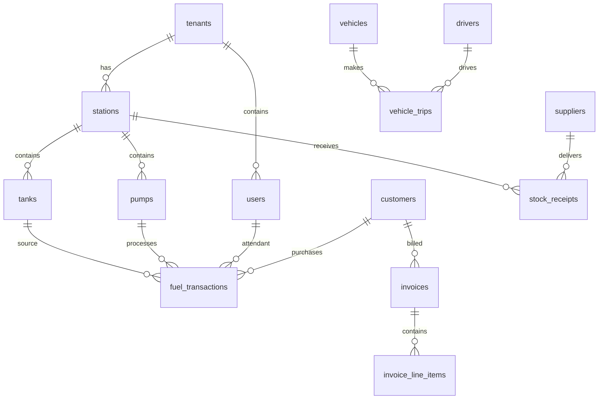

# Ghana OMC SaaS ERP - Database Documentation

## Table of Contents
1. [Database Overview](#database-overview)
2. [Schema Architecture](#schema-architecture)
3. [Core Tables](#core-tables)
4. [Relationships](#relationships)
5. [Indexes & Performance](#indexes--performance)
6. [Data Dictionary](#data-dictionary)
7. [Partitioning Strategy](#partitioning-strategy)
8. [Backup & Recovery](#backup--recovery)

---

## Database Overview

### Technology Stack
- **Primary Database**: PostgreSQL 15+ (ACID compliance)
- **Time-Series**: TimescaleDB (IoT sensor data)
- **Document Store**: MongoDB 6.0 (configurations, logs)
- **Cache**: Redis 7.0 (sessions, temporary data)
- **Analytics**: ClickHouse (OLAP queries)
- **Search**: Elasticsearch 8.0 (full-text search)

### Multi-Tenancy Design
- **Schema-per-tenant** isolation for data security
- **Shared reference data** schema for common lookups
- **Row-level security** policies for additional protection

---

## Schema Architecture

### Tenant Schema Structure
```sql
-- Each tenant gets their own schema
CREATE SCHEMA tenant_goil;    -- GOIL company data
CREATE SCHEMA tenant_shell;   -- Shell company data
CREATE SCHEMA tenant_total;   -- TotalEnergies data

-- Shared reference data
CREATE SCHEMA shared;         -- Countries, currencies, fuel types
CREATE SCHEMA system;         -- Application configuration
```

### Schema Naming Convention
- `tenant_{company_code}` - Tenant-specific data
- `shared` - Reference/master data
- `system` - Application metadata
- `audit` - Audit trails and logs
- `analytics` - Reporting and analytics views

---

## Core Tables

### 1. Authentication & Authorization

#### users
```sql
CREATE TABLE users (
    id UUID PRIMARY KEY DEFAULT gen_random_uuid(),
    tenant_id UUID NOT NULL REFERENCES tenants(id),
    username VARCHAR(50) UNIQUE NOT NULL,
    email VARCHAR(255) UNIQUE NOT NULL,
    password_hash VARCHAR(255) NOT NULL,
    first_name VARCHAR(100) NOT NULL,
    last_name VARCHAR(100) NOT NULL,
    phone_number VARCHAR(20),
    role_id UUID NOT NULL REFERENCES roles(id),
    status user_status DEFAULT 'active',
    last_login_at TIMESTAMPTZ,
    email_verified_at TIMESTAMPTZ,
    failed_login_attempts INTEGER DEFAULT 0,
    locked_until TIMESTAMPTZ,
    created_at TIMESTAMPTZ DEFAULT NOW(),
    updated_at TIMESTAMPTZ DEFAULT NOW(),
    created_by UUID REFERENCES users(id),
    updated_by UUID REFERENCES users(id)
);

-- User status enum
CREATE TYPE user_status AS ENUM ('active', 'inactive', 'suspended', 'pending_verification');
```

#### roles
```sql
CREATE TABLE roles (
    id UUID PRIMARY KEY DEFAULT gen_random_uuid(),
    tenant_id UUID REFERENCES tenants(id),
    name VARCHAR(50) NOT NULL,
    description TEXT,
    permissions JSONB NOT NULL DEFAULT '[]',
    is_system_role BOOLEAN DEFAULT FALSE,
    created_at TIMESTAMPTZ DEFAULT NOW(),
    updated_at TIMESTAMPTZ DEFAULT NOW()
);
```

#### tenants
```sql
CREATE TABLE tenants (
    id UUID PRIMARY KEY DEFAULT gen_random_uuid(),
    company_name VARCHAR(255) NOT NULL,
    company_code VARCHAR(10) UNIQUE NOT NULL,
    license_number VARCHAR(50) UNIQUE NOT NULL,
    business_registration VARCHAR(50),
    tax_identification VARCHAR(50),
    subscription_plan subscription_plan NOT NULL,
    subscription_status subscription_status DEFAULT 'trial',
    subscription_expires_at TIMESTAMPTZ,
    billing_contact JSONB,
    technical_contact JSONB,
    settings JSONB DEFAULT '{}',
    created_at TIMESTAMPTZ DEFAULT NOW(),
    updated_at TIMESTAMPTZ DEFAULT NOW()
);

CREATE TYPE subscription_plan AS ENUM ('starter', 'growth', 'professional', 'enterprise');
CREATE TYPE subscription_status AS ENUM ('trial', 'active', 'suspended', 'cancelled');
```

### 2. Station Management

#### stations
```sql
CREATE TABLE stations (
    id UUID PRIMARY KEY DEFAULT gen_random_uuid(),
    tenant_id UUID NOT NULL REFERENCES tenants(id),
    name VARCHAR(255) NOT NULL,
    code VARCHAR(20) UNIQUE NOT NULL,
    station_type station_type DEFAULT 'retail',
    address JSONB NOT NULL, -- Street, city, region, postal_code
    gps_coordinates POINT,
    manager_id UUID REFERENCES users(id),
    phone_number VARCHAR(20),
    email VARCHAR(255),
    operating_hours JSONB, -- Daily opening/closing times
    fuel_types fuel_type[] NOT NULL,
    status station_status DEFAULT 'active',
    commission_rate DECIMAL(5,4), -- Percentage for DODO stations
    last_inspection_date DATE,
    license_expiry_date DATE,
    created_at TIMESTAMPTZ DEFAULT NOW(),
    updated_at TIMESTAMPTZ DEFAULT NOW()
);

CREATE TYPE station_type AS ENUM ('retail', 'depot', 'terminal');
CREATE TYPE station_status AS ENUM ('active', 'inactive', 'maintenance', 'closed');
CREATE TYPE fuel_type AS ENUM ('PMS', 'AGO', 'IFO', 'LPG', 'KERO');
```

#### tanks
```sql
CREATE TABLE tanks (
    id UUID PRIMARY KEY DEFAULT gen_random_uuid(),
    station_id UUID NOT NULL REFERENCES stations(id),
    tank_number INTEGER NOT NULL,
    fuel_type fuel_type NOT NULL,
    capacity DECIMAL(12,3) NOT NULL, -- Liters
    current_level DECIMAL(12,3) DEFAULT 0,
    minimum_level DECIMAL(12,3) NOT NULL,
    maximum_level DECIMAL(12,3) NOT NULL,
    tank_type tank_type DEFAULT 'underground',
    material VARCHAR(50), -- Steel, fiberglass, etc.
    installation_date DATE,
    last_calibration_date DATE,
    calibration_certificate VARCHAR(100),
    status tank_status DEFAULT 'active',
    sensor_id VARCHAR(50), -- IoT sensor identifier
    created_at TIMESTAMPTZ DEFAULT NOW(),
    updated_at TIMESTAMPTZ DEFAULT NOW(),
    UNIQUE(station_id, tank_number)
);

CREATE TYPE tank_type AS ENUM ('underground', 'above_ground', 'mobile');
CREATE TYPE tank_status AS ENUM ('active', 'inactive', 'maintenance', 'decommissioned');
```

#### pumps
```sql
CREATE TABLE pumps (
    id UUID PRIMARY KEY DEFAULT gen_random_uuid(),
    station_id UUID NOT NULL REFERENCES stations(id),
    pump_number INTEGER NOT NULL,
    tank_id UUID NOT NULL REFERENCES tanks(id),
    nozzle_count INTEGER DEFAULT 1,
    pump_type pump_type DEFAULT 'dispensing',
    manufacturer VARCHAR(100),
    model VARCHAR(100),
    serial_number VARCHAR(100),
    installation_date DATE,
    last_calibration_date DATE,
    calibration_certificate VARCHAR(100),
    status pump_status DEFAULT 'active',
    created_at TIMESTAMPTZ DEFAULT NOW(),
    updated_at TIMESTAMPTZ DEFAULT NOW(),
    UNIQUE(station_id, pump_number)
);

CREATE TYPE pump_type AS ENUM ('dispensing', 'loading', 'transfer');
CREATE TYPE pump_status AS ENUM ('active', 'inactive', 'maintenance', 'faulty');
```

### 3. Transaction Management

#### fuel_transactions (Partitioned Table)
```sql
CREATE TABLE fuel_transactions (
    id BIGSERIAL,
    tenant_id UUID NOT NULL,
    station_id UUID NOT NULL,
    pump_id UUID NOT NULL,
    tank_id UUID NOT NULL,
    attendant_id UUID REFERENCES users(id),
    customer_id UUID REFERENCES customers(id),
    shift_id UUID REFERENCES shifts(id),
    
    -- Fuel details
    fuel_type fuel_type NOT NULL,
    quantity_liters DECIMAL(10,3) NOT NULL CHECK (quantity_liters > 0),
    unit_price DECIMAL(8,4) NOT NULL CHECK (unit_price > 0),
    gross_amount DECIMAL(12,2) GENERATED ALWAYS AS (quantity_liters * unit_price) STORED,
    
    -- Taxes and charges
    tax_rate DECIMAL(5,4) NOT NULL DEFAULT 0.175, -- 17.5% VAT
    tax_amount DECIMAL(12,2) GENERATED ALWAYS AS (gross_amount * tax_rate) STORED,
    service_charge DECIMAL(12,2) DEFAULT 0,
    total_amount DECIMAL(12,2) GENERATED ALWAYS AS (gross_amount + tax_amount + service_charge) STORED,
    
    -- Payment details
    payment_method payment_method NOT NULL,
    payment_reference VARCHAR(100),
    payment_status payment_status DEFAULT 'pending',
    payment_processed_at TIMESTAMPTZ,
    
    -- Transaction metadata
    receipt_number VARCHAR(50) UNIQUE NOT NULL,
    pos_reference VARCHAR(50), -- POS system reference
    transaction_time TIMESTAMPTZ NOT NULL DEFAULT NOW(),
    status transaction_status DEFAULT 'pending',
    
    -- Quality metrics
    temperature DECIMAL(4,1), -- Fuel temperature
    density DECIMAL(6,4), -- Specific gravity
    
    -- Loyalty and discounts
    loyalty_points_awarded INTEGER DEFAULT 0,
    discount_amount DECIMAL(12,2) DEFAULT 0,
    
    created_at TIMESTAMPTZ DEFAULT NOW(),
    updated_at TIMESTAMPTZ DEFAULT NOW(),
    
    PRIMARY KEY (id, transaction_time) -- Include partition key in PK
) PARTITION BY RANGE (transaction_time);

-- Partition definitions (monthly)
CREATE TABLE fuel_transactions_2025_01 PARTITION OF fuel_transactions
    FOR VALUES FROM ('2025-01-01') TO ('2025-02-01');
CREATE TABLE fuel_transactions_2025_02 PARTITION OF fuel_transactions
    FOR VALUES FROM ('2025-02-01') TO ('2025-03-01');

CREATE TYPE payment_method AS ENUM ('cash', 'card', 'mobile_money', 'credit', 'voucher');
CREATE TYPE payment_status AS ENUM ('pending', 'completed', 'failed', 'refunded');
CREATE TYPE transaction_status AS ENUM ('pending', 'completed', 'cancelled', 'disputed');
```

### 4. Inventory Management

#### stock_receipts
```sql
CREATE TABLE stock_receipts (
    id UUID PRIMARY KEY DEFAULT gen_random_uuid(),
    tenant_id UUID NOT NULL,
    station_id UUID NOT NULL REFERENCES stations(id),
    supplier_id UUID NOT NULL REFERENCES suppliers(id),
    vehicle_id UUID REFERENCES vehicles(id),
    driver_id UUID REFERENCES drivers(id),
    
    -- Receipt details
    receipt_number VARCHAR(50) UNIQUE NOT NULL,
    delivery_note_number VARCHAR(50),
    purchase_order_id UUID REFERENCES purchase_orders(id),
    
    -- Fuel details
    total_quantity DECIMAL(12,3) NOT NULL,
    total_value DECIMAL(15,2) NOT NULL,
    currency currency_code DEFAULT 'GHS',
    
    -- Quality control
    quality_certificate VARCHAR(100),
    temperature_recorded DECIMAL(4,1),
    density_recorded DECIMAL(6,4),
    quality_status quality_status DEFAULT 'pending',
    quality_notes TEXT,
    
    -- Documentation
    photos TEXT[], -- Array of photo URLs
    documents TEXT[], -- Array of document URLs
    
    -- Timestamps
    scheduled_delivery_time TIMESTAMPTZ,
    actual_delivery_time TIMESTAMPTZ,
    receipt_confirmed_at TIMESTAMPTZ,
    
    status receipt_status DEFAULT 'pending',
    notes TEXT,
    
    created_at TIMESTAMPTZ DEFAULT NOW(),
    updated_at TIMESTAMPTZ DEFAULT NOW(),
    created_by UUID REFERENCES users(id)
);

CREATE TYPE quality_status AS ENUM ('pending', 'passed', 'failed', 'conditional');
CREATE TYPE receipt_status AS ENUM ('pending', 'confirmed', 'disputed', 'cancelled');
CREATE TYPE currency_code AS ENUM ('GHS', 'USD', 'EUR', 'GBP');
```

#### stock_receipt_items
```sql
CREATE TABLE stock_receipt_items (
    id UUID PRIMARY KEY DEFAULT gen_random_uuid(),
    stock_receipt_id UUID NOT NULL REFERENCES stock_receipts(id) ON DELETE CASCADE,
    tank_id UUID NOT NULL REFERENCES tanks(id),
    fuel_type fuel_type NOT NULL,
    quantity DECIMAL(10,3) NOT NULL,
    unit_price DECIMAL(8,4) NOT NULL,
    line_total DECIMAL(12,2) GENERATED ALWAYS AS (quantity * unit_price) STORED,
    temperature DECIMAL(4,1),
    density DECIMAL(6,4),
    created_at TIMESTAMPTZ DEFAULT NOW()
);
```

#### inventory_movements
```sql
CREATE TABLE inventory_movements (
    id UUID PRIMARY KEY DEFAULT gen_random_uuid(),
    tenant_id UUID NOT NULL,
    station_id UUID NOT NULL REFERENCES stations(id),
    tank_id UUID NOT NULL REFERENCES tanks(id),
    fuel_type fuel_type NOT NULL,
    
    movement_type movement_type NOT NULL,
    reference_id UUID, -- Reference to transaction, receipt, etc.
    reference_type VARCHAR(50), -- 'transaction', 'receipt', 'adjustment'
    
    quantity_before DECIMAL(12,3) NOT NULL,
    quantity_change DECIMAL(12,3) NOT NULL, -- Positive for in, negative for out
    quantity_after DECIMAL(12,3) NOT NULL,
    
    unit_price DECIMAL(8,4),
    total_value DECIMAL(12,2),
    
    notes TEXT,
    movement_time TIMESTAMPTZ NOT NULL DEFAULT NOW(),
    created_by UUID REFERENCES users(id)
) PARTITION BY RANGE (movement_time);

CREATE TYPE movement_type AS ENUM ('in', 'out', 'adjustment', 'transfer', 'loss');
```

### 5. Fleet Management

#### vehicles
```sql
CREATE TABLE vehicles (
    id UUID PRIMARY KEY DEFAULT gen_random_uuid(),
    tenant_id UUID NOT NULL,
    license_plate VARCHAR(20) UNIQUE NOT NULL,
    vehicle_type vehicle_type NOT NULL,
    make VARCHAR(50),
    model VARCHAR(50),
    year INTEGER,
    vin VARCHAR(50),
    
    -- Capacity details
    total_capacity DECIMAL(10,3), -- Liters
    compartment_count INTEGER DEFAULT 1,
    compartment_config JSONB, -- Array of compartment capacities
    
    -- Registration and compliance
    registration_expiry DATE,
    insurance_expiry DATE,
    road_worthy_expiry DATE,
    gps_device_id VARCHAR(50),
    
    -- Current status
    status vehicle_status DEFAULT 'active',
    current_location POINT,
    current_driver_id UUID REFERENCES drivers(id),
    
    created_at TIMESTAMPTZ DEFAULT NOW(),
    updated_at TIMESTAMPTZ DEFAULT NOW()
);

CREATE TYPE vehicle_type AS ENUM ('truck', 'tanker', 'van', 'motorcycle');
CREATE TYPE vehicle_status AS ENUM ('active', 'inactive', 'maintenance', 'breakdown');
```

#### drivers
```sql
CREATE TABLE drivers (
    id UUID PRIMARY KEY DEFAULT gen_random_uuid(),
    tenant_id UUID NOT NULL,
    driver_license VARCHAR(50) UNIQUE NOT NULL,
    first_name VARCHAR(100) NOT NULL,
    last_name VARCHAR(100) NOT NULL,
    phone_number VARCHAR(20) NOT NULL,
    email VARCHAR(255),
    address JSONB,
    
    -- License details
    license_class VARCHAR(10) NOT NULL, -- A, B, C, etc.
    license_expiry DATE NOT NULL,
    hazmat_certified BOOLEAN DEFAULT FALSE,
    hazmat_expiry DATE,
    
    -- Employment
    employee_id VARCHAR(50),
    hire_date DATE,
    status driver_status DEFAULT 'active',
    
    created_at TIMESTAMPTZ DEFAULT NOW(),
    updated_at TIMESTAMPTZ DEFAULT NOW()
);

CREATE TYPE driver_status AS ENUM ('active', 'inactive', 'suspended', 'terminated');
```

#### vehicle_trips
```sql
CREATE TABLE vehicle_trips (
    id UUID PRIMARY KEY DEFAULT gen_random_uuid(),
    tenant_id UUID NOT NULL,
    vehicle_id UUID NOT NULL REFERENCES vehicles(id),
    driver_id UUID NOT NULL REFERENCES drivers(id),
    
    -- Route details
    origin_station_id UUID REFERENCES stations(id),
    destination_station_id UUID REFERENCES stations(id),
    planned_route JSONB, -- Array of coordinates
    actual_route JSONB,
    
    -- Cargo manifest
    cargo JSONB NOT NULL, -- Array of fuel types and quantities
    
    -- Trip timeline
    scheduled_departure TIMESTAMPTZ,
    actual_departure TIMESTAMPTZ,
    estimated_arrival TIMESTAMPTZ,
    actual_arrival TIMESTAMPTZ,
    
    -- Metrics
    distance_planned DECIMAL(8,2), -- Kilometers
    distance_actual DECIMAL(8,2),
    fuel_consumed DECIMAL(8,3), -- Liters
    
    status trip_status DEFAULT 'scheduled',
    notes TEXT,
    
    created_at TIMESTAMPTZ DEFAULT NOW(),
    updated_at TIMESTAMPTZ DEFAULT NOW()
);

CREATE TYPE trip_status AS ENUM ('scheduled', 'in_progress', 'completed', 'cancelled', 'delayed');
```

### 6. Customer Management

#### customers
```sql
CREATE TABLE customers (
    id UUID PRIMARY KEY DEFAULT gen_random_uuid(),
    tenant_id UUID NOT NULL,
    customer_type customer_type NOT NULL,
    
    -- Basic information
    first_name VARCHAR(100),
    last_name VARCHAR(100),
    company_name VARCHAR(255),
    email VARCHAR(255),
    phone_number VARCHAR(20),
    
    -- Address
    address JSONB,
    
    -- Business details (for corporate customers)
    tax_id VARCHAR(50),
    business_registration VARCHAR(50),
    credit_limit DECIMAL(15,2) DEFAULT 0,
    payment_terms INTEGER DEFAULT 0, -- Days
    
    -- Loyalty program
    loyalty_card_number VARCHAR(50),
    loyalty_points INTEGER DEFAULT 0,
    loyalty_tier loyalty_tier DEFAULT 'bronze',
    
    -- Status and dates
    status customer_status DEFAULT 'active',
    registration_date DATE DEFAULT CURRENT_DATE,
    
    created_at TIMESTAMPTZ DEFAULT NOW(),
    updated_at TIMESTAMPTZ DEFAULT NOW()
);

CREATE TYPE customer_type AS ENUM ('individual', 'corporate');
CREATE TYPE customer_status AS ENUM ('active', 'inactive', 'suspended', 'vip');
CREATE TYPE loyalty_tier AS ENUM ('bronze', 'silver', 'gold', 'platinum');
```

### 7. Financial Management

#### invoices
```sql
CREATE TABLE invoices (
    id UUID PRIMARY KEY DEFAULT gen_random_uuid(),
    tenant_id UUID NOT NULL,
    invoice_number VARCHAR(50) UNIQUE NOT NULL,
    customer_id UUID NOT NULL REFERENCES customers(id),
    station_id UUID REFERENCES stations(id),
    
    -- Invoice details
    issue_date DATE NOT NULL DEFAULT CURRENT_DATE,
    due_date DATE NOT NULL,
    currency currency_code DEFAULT 'GHS',
    
    -- Amounts
    subtotal DECIMAL(15,2) NOT NULL,
    tax_amount DECIMAL(15,2) NOT NULL,
    discount_amount DECIMAL(15,2) DEFAULT 0,
    total_amount DECIMAL(15,2) NOT NULL,
    amount_paid DECIMAL(15,2) DEFAULT 0,
    amount_due DECIMAL(15,2) GENERATED ALWAYS AS (total_amount - amount_paid) STORED,
    
    -- Payment terms
    payment_terms INTEGER, -- Days
    late_fee_rate DECIMAL(5,4) DEFAULT 0,
    
    -- Status and notes
    status invoice_status DEFAULT 'draft',
    notes TEXT,
    
    -- Metadata
    created_at TIMESTAMPTZ DEFAULT NOW(),
    updated_at TIMESTAMPTZ DEFAULT NOW(),
    created_by UUID REFERENCES users(id)
);

CREATE TYPE invoice_status AS ENUM ('draft', 'sent', 'viewed', 'paid', 'overdue', 'cancelled');
```

#### invoice_line_items
```sql
CREATE TABLE invoice_line_items (
    id UUID PRIMARY KEY DEFAULT gen_random_uuid(),
    invoice_id UUID NOT NULL REFERENCES invoices(id) ON DELETE CASCADE,
    
    -- Line item details
    description TEXT NOT NULL,
    fuel_type fuel_type,
    quantity DECIMAL(10,3) NOT NULL,
    unit_price DECIMAL(8,4) NOT NULL,
    line_total DECIMAL(12,2) GENERATED ALWAYS AS (quantity * unit_price) STORED,
    
    -- Tax details
    tax_rate DECIMAL(5,4) DEFAULT 0.175,
    tax_amount DECIMAL(12,2) GENERATED ALWAYS AS (line_total * tax_rate) STORED,
    
    line_order INTEGER NOT NULL,
    
    created_at TIMESTAMPTZ DEFAULT NOW()
);
```

### 8. Time-Series Data (TimescaleDB)

#### tank_readings
```sql
CREATE TABLE tank_readings (
    time TIMESTAMPTZ NOT NULL,
    tank_id UUID NOT NULL,
    station_id UUID NOT NULL,
    tenant_id UUID NOT NULL,
    
    -- Sensor readings
    fuel_level DECIMAL(10,3) NOT NULL,
    temperature DECIMAL(5,2),
    pressure DECIMAL(8,2),
    water_level DECIMAL(6,3) DEFAULT 0,
    density DECIMAL(6,4),
    
    -- Calculated values
    volume_at_15c DECIMAL(10,3), -- Temperature corrected volume
    percentage_full DECIMAL(5,2) GENERATED ALWAYS AS ((fuel_level / 
        (SELECT capacity FROM tanks WHERE id = tank_id)) * 100) STORED,
    
    -- Data quality
    sensor_status sensor_status DEFAULT 'normal',
    data_quality DECIMAL(3,2) DEFAULT 1.0, -- 0-1 quality score
    
    created_at TIMESTAMPTZ DEFAULT NOW(),
    
    PRIMARY KEY (time, tank_id)
);

-- Create hypertable for time-series optimization
SELECT create_hypertable('tank_readings', 'time', chunk_time_interval => INTERVAL '1 day');

CREATE TYPE sensor_status AS ENUM ('normal', 'warning', 'error', 'offline');
```

#### pump_transactions_log
```sql
CREATE TABLE pump_transactions_log (
    time TIMESTAMPTZ NOT NULL,
    pump_id UUID NOT NULL,
    station_id UUID NOT NULL,
    tenant_id UUID NOT NULL,
    
    -- Transaction details
    transaction_id BIGINT,
    fuel_type fuel_type,
    quantity DECIMAL(8,3),
    flow_rate DECIMAL(6,2), -- Liters per minute
    duration INTEGER, -- Seconds
    
    -- Pump status
    pump_status pump_log_status,
    error_codes INTEGER[],
    
    created_at TIMESTAMPTZ DEFAULT NOW(),
    
    PRIMARY KEY (time, pump_id)
);

-- Create hypertable
SELECT create_hypertable('pump_transactions_log', 'time');

CREATE TYPE pump_log_status AS ENUM ('idle', 'dispensing', 'stopped', 'error');
```

---

## Relationships

### Entity Relationship Diagram



### Foreign Key Constraints

#### Critical Constraints
```sql
-- Ensure transaction integrity
ALTER TABLE fuel_transactions ADD CONSTRAINT fk_transaction_station
    FOREIGN KEY (station_id) REFERENCES stations(id) ON DELETE RESTRICT;

-- Prevent deletion of active tanks
ALTER TABLE fuel_transactions ADD CONSTRAINT fk_transaction_tank
    FOREIGN KEY (tank_id) REFERENCES tanks(id) ON DELETE RESTRICT;

-- Maintain user audit trails
ALTER TABLE fuel_transactions ADD CONSTRAINT fk_transaction_attendant
    FOREIGN KEY (attendant_id) REFERENCES users(id) ON DELETE SET NULL;
```

#### Cascade Relationships
```sql
-- Remove related items when invoice is deleted
ALTER TABLE invoice_line_items ADD CONSTRAINT fk_line_item_invoice
    FOREIGN KEY (invoice_id) REFERENCES invoices(id) ON DELETE CASCADE;

-- Remove stock receipt items with receipt
ALTER TABLE stock_receipt_items ADD CONSTRAINT fk_receipt_item_receipt
    FOREIGN KEY (stock_receipt_id) REFERENCES stock_receipts(id) ON DELETE CASCADE;
```

---

## Indexes & Performance

### Primary Indexes

#### Transaction Performance
```sql
-- High-frequency transaction queries
CREATE INDEX CONCURRENTLY idx_transactions_station_time 
    ON fuel_transactions(station_id, transaction_time DESC);

CREATE INDEX CONCURRENTLY idx_transactions_attendant_time 
    ON fuel_transactions(attendant_id, transaction_time DESC)
    WHERE attendant_id IS NOT NULL;

CREATE INDEX CONCURRENTLY idx_transactions_customer 
    ON fuel_transactions(customer_id)
    WHERE customer_id IS NOT NULL;

CREATE INDEX CONCURRENTLY idx_transactions_receipt 
    ON fuel_transactions(receipt_number);

-- Payment status queries
CREATE INDEX CONCURRENTLY idx_transactions_payment_status 
    ON fuel_transactions(payment_status, transaction_time)
    WHERE payment_status IN ('pending', 'failed');
```

#### Inventory Queries
```sql
-- Tank level monitoring
CREATE INDEX CONCURRENTLY idx_tank_readings_tank_time 
    ON tank_readings(tank_id, time DESC);

-- Station inventory overview
CREATE INDEX CONCURRENTLY idx_tank_readings_station_time 
    ON tank_readings(station_id, time DESC);

-- Low level alerts
CREATE INDEX CONCURRENTLY idx_tank_readings_alerts 
    ON tank_readings(fuel_level, time DESC)
    WHERE percentage_full < 25;
```

#### Financial Queries
```sql
-- Invoice management
CREATE INDEX CONCURRENTLY idx_invoices_customer_status 
    ON invoices(customer_id, status, due_date);

CREATE INDEX CONCURRENTLY idx_invoices_overdue 
    ON invoices(due_date, status)
    WHERE status IN ('sent', 'viewed') AND due_date < CURRENT_DATE;

-- Payment tracking
CREATE INDEX CONCURRENTLY idx_invoices_amount_due 
    ON invoices(amount_due, due_date)
    WHERE amount_due > 0;
```

### Composite Indexes
```sql
-- Multi-tenant queries (most common pattern)
CREATE INDEX CONCURRENTLY idx_stations_tenant_status 
    ON stations(tenant_id, status);

CREATE INDEX CONCURRENTLY idx_users_tenant_role 
    ON users(tenant_id, role_id, status);

-- Reporting queries
CREATE INDEX CONCURRENTLY idx_transactions_reporting 
    ON fuel_transactions(tenant_id, station_id, fuel_type, transaction_time)
    WHERE status = 'completed';
```

### Partial Indexes
```sql
-- Active records only (most queries filter on active status)
CREATE INDEX CONCURRENTLY idx_stations_active 
    ON stations(tenant_id, name)
    WHERE status = 'active';

CREATE INDEX CONCURRENTLY idx_users_active 
    ON users(tenant_id, email)
    WHERE status = 'active';

-- Pending transactions (operational priority)
CREATE INDEX CONCURRENTLY idx_transactions_pending 
    ON fuel_transactions(station_id, created_at)
    WHERE status = 'pending';
```

### Performance Monitoring
```sql
-- Monitor index usage
SELECT 
    schemaname,
    tablename,
    indexname,
    idx_tup_read,
    idx_tup_fetch
FROM pg_stat_user_indexes
ORDER BY idx_tup_read DESC;

-- Find unused indexes
SELECT 
    schemaname,
    tablename,
    indexname,
    idx_scan
FROM pg_stat_user_indexes
WHERE idx_scan = 0;
```

---

## Data Dictionary

### Core Data Types

#### Business Enums
```sql
-- Fuel types used in Ghana
fuel_type: 'PMS' (Petrol), 'AGO' (Diesel), 'IFO' (Industrial Fuel Oil), 
           'LPG' (Liquefied Petroleum Gas), 'KERO' (Kerosene)

-- Payment methods
payment_method: 'cash', 'card', 'mobile_money', 'credit', 'voucher'

-- Status indicators
general_status: 'active', 'inactive', 'suspended', 'pending'
```

#### Measurement Units
```sql
-- Volume: Always in liters (L)
-- Weight: Always in kilograms (KG)
-- Distance: Always in kilometers (KM)
-- Currency: Stored as DECIMAL(15,2) for precision
-- Coordinates: Stored as PostGIS POINT type
```

#### Naming Conventions

#### Table Names
- Singular nouns (user, transaction, station)
- Snake_case for compound names (fuel_transactions, stock_receipts)
- Suffix with purpose for link tables (_items, _log, _history)

#### Column Names
- Snake_case throughout
- Suffixes: _id (foreign keys), _at (timestamps), _date (dates)
- Boolean columns: is_*, has_*, can_*
- Status columns: status, payment_status, etc.

#### Constraint Names
- Primary Keys: pk_{table_name}
- Foreign Keys: fk_{table_name}_{referenced_table}
- Unique Constraints: uk_{table_name}_{column(s)}
- Check Constraints: ck_{table_name}_{constraint_name}

---

## Partitioning Strategy

### Time-Based Partitioning

#### Transaction Tables (High Volume)
```sql
-- Monthly partitions for fuel_transactions
-- Automatic partition creation
CREATE OR REPLACE FUNCTION create_monthly_partitions()
RETURNS void AS $$
DECLARE
    start_date DATE;
    end_date DATE;
    partition_name TEXT;
BEGIN
    -- Create partitions for next 12 months
    FOR i IN 0..11 LOOP
        start_date := DATE_TRUNC('month', CURRENT_DATE) + (i || ' months')::interval;
        end_date := start_date + interval '1 month';
        partition_name := 'fuel_transactions_' || TO_CHAR(start_date, 'YYYY_MM');
        
        EXECUTE format('CREATE TABLE IF NOT EXISTS %I PARTITION OF fuel_transactions
                       FOR VALUES FROM (%L) TO (%L)',
                       partition_name, start_date, end_date);
    END LOOP;
END;
$$ LANGUAGE plpgsql;

-- Schedule monthly execution
SELECT cron.schedule('create-partitions', '0 0 1 * *', 'SELECT create_monthly_partitions();');
```

#### Log Tables (Very High Volume)
```sql
-- Daily partitions for audit logs and IoT data
CREATE TABLE audit_logs (
    id BIGSERIAL,
    tenant_id UUID NOT NULL,
    table_name VARCHAR(50) NOT NULL,
    operation VARCHAR(10) NOT NULL,
    old_values JSONB,
    new_values JSONB,
    changed_by UUID REFERENCES users(id),
    changed_at TIMESTAMPTZ NOT NULL DEFAULT NOW(),
    PRIMARY KEY (id, changed_at)
) PARTITION BY RANGE (changed_at);
```

### Tenant-Based Partitioning (Future Consideration)
```sql
-- For very large installations, consider tenant partitioning
-- Currently using schema-based isolation, but could evolve to:
CREATE TABLE fuel_transactions_large_tenant PARTITION OF fuel_transactions
    FOR VALUES IN ('tenant_uuid_1', 'tenant_uuid_2', 'tenant_uuid_3');
```

---

## Backup & Recovery

### Backup Strategy

#### Full Backups
```bash
#!/bin/bash
# Daily full backup script
BACKUP_DIR="/backups/postgresql"
DATE=$(date +%Y%m%d_%H%M%S)
DB_NAME="omc_erp"

# Create compressed backup
pg_dump -h localhost -U postgres -d $DB_NAME \
    --format=custom \
    --compress=9 \
    --no-owner \
    --no-privileges \
    --file="$BACKUP_DIR/full_backup_$DATE.backup"

# Verify backup
pg_restore --list "$BACKUP_DIR/full_backup_$DATE.backup" > /dev/null
if [ $? -eq 0 ]; then
    echo "Backup completed successfully: full_backup_$DATE.backup"
else
    echo "Backup verification failed!"
    exit 1
fi

# Cleanup old backups (keep 30 days)
find $BACKUP_DIR -name "full_backup_*.backup" -mtime +30 -delete
```

#### Point-in-Time Recovery Setup
```bash
# WAL archiving configuration in postgresql.conf
archive_mode = on
archive_command = 'aws s3 cp %p s3://omc-erp-wal-archive/%f'
archive_timeout = 300  # Archive every 5 minutes

# Continuous archiving
wal_level = replica
max_wal_senders = 3
```

#### Tenant-Specific Backups
```sql
-- Backup specific tenant data
CREATE OR REPLACE FUNCTION backup_tenant(tenant_uuid UUID)
RETURNS void AS $$
DECLARE
    schema_name TEXT;
BEGIN
    -- Get tenant schema name
    SELECT 'tenant_' || company_code INTO schema_name
    FROM tenants WHERE id = tenant_uuid;
    
    -- Backup tenant schema
    PERFORM pg_dump_schema(schema_name);
END;
$$ LANGUAGE plpgsql;
```

### Recovery Procedures

#### Database Recovery
```bash
#!/bin/bash
# Point-in-time recovery procedure

# 1. Stop PostgreSQL
systemctl stop postgresql

# 2. Restore base backup
rm -rf /var/lib/postgresql/15/main/*
tar -xzf /backups/base_backup_20250112.tar.gz -C /var/lib/postgresql/15/main/

# 3. Create recovery configuration
cat > /var/lib/postgresql/15/main/recovery.conf << EOF
restore_command = 'aws s3 cp s3://omc-erp-wal-archive/%f %p'
recovery_target_time = '2025-01-12 14:30:00'
EOF

# 4. Start PostgreSQL
systemctl start postgresql

# 5. Monitor recovery
tail -f /var/log/postgresql/postgresql-15-main.log
```

#### Tenant Data Recovery
```sql
-- Restore specific tenant from backup
\c omc_erp_recovery

-- Import tenant schema
\i /backups/tenant_goil_20250112.sql

-- Verify data integrity
SELECT COUNT(*) FROM tenant_goil.fuel_transactions;
SELECT MAX(created_at) FROM tenant_goil.stations;
```

### Backup Validation
```sql
-- Automated backup validation queries
CREATE OR REPLACE FUNCTION validate_backup()
RETURNS TABLE (
    table_name TEXT,
    row_count BIGINT,
    last_updated TIMESTAMPTZ,
    status TEXT
) AS $$
BEGIN
    RETURN QUERY
    SELECT 
        t.table_name::TEXT,
        (xpath('//row/c/text()', 
               query_to_xml(format('SELECT COUNT(*) FROM %I', t.table_name), 
                           true, true, '')))[1]::TEXT::BIGINT as row_count,
        COALESCE(
            (xpath('//row/c/text()', 
                   query_to_xml(format('SELECT MAX(updated_at) FROM %I', t.table_name), 
                               true, true, '')))[1]::TEXT::TIMESTAMPTZ,
            (xpath('//row/c/text()', 
                   query_to_xml(format('SELECT MAX(created_at) FROM %I', t.table_name), 
                               true, true, '')))[1]::TEXT::TIMESTAMPTZ
        ) as last_updated,
        CASE 
            WHEN (xpath('//row/c/text()', 
                       query_to_xml(format('SELECT COUNT(*) FROM %I', t.table_name), 
                                   true, true, '')))[1]::TEXT::BIGINT > 0 
            THEN 'OK'::TEXT
            ELSE 'EMPTY'::TEXT
        END as status
    FROM information_schema.tables t
    WHERE t.table_schema = current_schema()
      AND t.table_type = 'BASE TABLE'
      AND t.table_name NOT LIKE '%_log'
    ORDER BY t.table_name;
END;
$$ LANGUAGE plpgsql;
```

---

## Maintenance Procedures

### Routine Maintenance

#### Daily Tasks
```sql
-- Update table statistics
ANALYZE;

-- Vacuum frequently updated tables
VACUUM ANALYZE fuel_transactions;
VACUUM ANALYZE tank_readings;
VACUUM ANALYZE users;
```

#### Weekly Tasks
```sql
-- Reindex heavily used indexes
REINDEX INDEX CONCURRENTLY idx_transactions_station_time;
REINDEX INDEX CONCURRENTLY idx_tank_readings_tank_time;

-- Clean up old partitions (keep 2 years of transaction data)
DROP TABLE IF EXISTS fuel_transactions_2023_01;
DROP TABLE IF EXISTS fuel_transactions_2023_02;
```

#### Monthly Tasks
```sql
-- Full database statistics update
ANALYZE;

-- Check for bloat and fragmentation
SELECT 
    schemaname,
    tablename,
    n_tup_ins,
    n_tup_upd,
    n_tup_del,
    n_dead_tup
FROM pg_stat_user_tables
WHERE n_dead_tup > 1000
ORDER BY n_dead_tup DESC;

-- Vacuum full for heavily fragmented tables (during maintenance window)
-- VACUUM FULL fuel_transactions; -- Use carefully, requires exclusive lock
```

---

*Document Version: 1.0*  
*Last Updated: January 2025*  
*Next Review: April 2025*