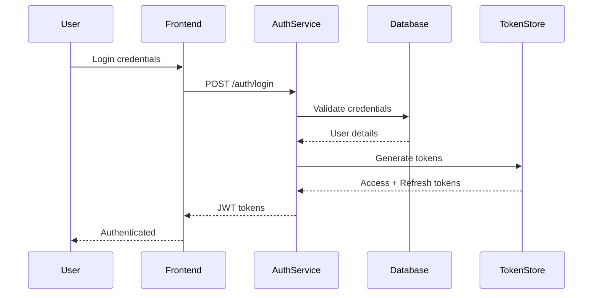

# Ghana OMC SaaS ERP - System Architecture Document

## Table of Contents
1. [Architecture Overview](#architecture-overview)
2. [System Components](#system-components)
3. [Microservices Architecture](#microservices-architecture)
4. [Data Architecture](#data-architecture)
5. [Security Architecture](#security-architecture)
6. [Integration Architecture](#integration-architecture)
7. [Deployment Architecture](#deployment-architecture)
8. [Performance & Scalability](#performance--scalability)

---

## Architecture Overview

### System Type
**Primary**: Cloud-based Multi-tenant SaaS ERP Platform  
**Secondary**: Mobile Applications for Field Operations

### Architecture Principles
1. **Cloud-Native**: Built for cloud deployment from ground up
2. **Microservices**: Loosely coupled, independently deployable services
3. **API-First**: All functionality exposed through well-defined APIs
4. **Event-Driven**: Asynchronous communication via event streaming
5. **Security by Design**: Security controls at every layer
6. **Scalability**: Horizontal scaling capability for all components

### High-Level Architecture Diagram

```
┌────────────────────────────────────────────────────────────────┐
│                         CLIENT LAYER                            │
├────────────────────────────────────────────────────────────────┤
│   Web Browsers | Mobile Apps | API Clients | IoT Devices       │
└────────────────────────────────────────────────────────────────┘
                                │
                                ▼
┌────────────────────────────────────────────────────────────────┐
│                      PRESENTATION LAYER                         │
├────────────────────────────────────────────────────────────────┤
│   Admin Dashboard | Customer Portal | B2B Portal | Mobile PWA   │
│          (React/Next.js)        (React Native)                  │
└────────────────────────────────────────────────────────────────┘
                                │
                                ▼
┌────────────────────────────────────────────────────────────────┐
│                        API GATEWAY                              │
├────────────────────────────────────────────────────────────────┤
│     Kong Gateway | Rate Limiting | Authentication | Routing     │
│              GraphQL Federation | REST APIs                     │
└────────────────────────────────────────────────────────────────┘
                                │
                                ▼
┌────────────────────────────────────────────────────────────────┐
│                    SERVICE MESH (Istio)                         │
├────────────────────────────────────────────────────────────────┤
│   Service Discovery | Load Balancing | Circuit Breaker | mTLS   │
└────────────────────────────────────────────────────────────────┘
                                │
                                ▼
┌────────────────────────────────────────────────────────────────┐
│                     MICROSERVICES LAYER                         │
├────────────────────────────────────────────────────────────────┤
│ ┌─────────────┐ ┌─────────────┐ ┌─────────────┐ ┌────────────┐│
│ │Auth Service │ │Supply Chain │ │   Retail    │ │   Fleet    ││
│ │             │ │  Service    │ │  Service    │ │  Service   ││
│ └─────────────┘ └─────────────┘ └─────────────┘ └────────────┘│
│ ┌─────────────┐ ┌─────────────┐ ┌─────────────┐ ┌────────────┐│
│ │  Financial  │ │ Regulatory  │ │     HR      │ │Maintenance ││
│ │   Service   │ │  Service    │ │  Service    │ │  Service   ││
│ └─────────────┘ └─────────────┘ └─────────────┘ └────────────┘│
│ ┌─────────────┐ ┌─────────────┐ ┌─────────────┐ ┌────────────┐│
│ │     CRM     │ │  Analytics  │ │Notification │ │   Audit    ││
│ │   Service   │ │   Service   │ │  Service    │ │  Service   ││
│ └─────────────┘ └─────────────┘ └─────────────┘ └────────────┘│
│ ┌─────────────┐ ┌─────────────┐ ┌─────────────┐ ┌────────────┐│
│ │   Pricing   │ │    UPPF     │ │   Dealer    │ │ Inventory  ││
│ │   Service   │ │  Service    │ │  Service    │ │  Service   ││
│ └─────────────┘ └─────────────┘ └─────────────┘ └────────────┘│
└────────────────────────────────────────────────────────────────┘
                                │
                                ▼
┌────────────────────────────────────────────────────────────────┐
│                    EVENT STREAMING LAYER                        │
├────────────────────────────────────────────────────────────────┤
│         Apache Kafka | Event Store | Message Routing            │
└────────────────────────────────────────────────────────────────┘
                                │
                                ▼
┌────────────────────────────────────────────────────────────────┐
│                        DATA LAYER                               │
├────────────────────────────────────────────────────────────────┤
│ ┌─────────────┐ ┌─────────────┐ ┌─────────────┐ ┌────────────┐│
│ │ PostgreSQL  │ │TimescaleDB  │ │   MongoDB   │ │   Redis    ││
│ │   (OLTP)    │ │(Time-Series)│ │ (Document)  │ │  (Cache)   ││
│ └─────────────┘ └─────────────┘ └─────────────┘ └────────────┘│
│ ┌─────────────┐ ┌─────────────┐ ┌─────────────┐ ┌────────────┐│
│ │ ClickHouse  │ │Elasticsearch│ │  Weaviate   │ │    S3      ││
│ │ (Analytics) │ │  (Search)   │ │ (Vector DB) │ │ (Storage)  ││
│ └─────────────┘ └─────────────┘ └─────────────┘ └────────────┘│
└────────────────────────────────────────────────────────────────┘
                                │
                                ▼
┌────────────────────────────────────────────────────────────────┐
│                      AI/ML PLATFORM                             │
├────────────────────────────────────────────────────────────────┤
│   MLflow | TensorFlow | PyTorch | NVIDIA Triton | LangChain    │
└────────────────────────────────────────────────────────────────┘
                                │
                                ▼
┌────────────────────────────────────────────────────────────────┐
│                   EXTERNAL INTEGRATIONS                         │
├────────────────────────────────────────────────────────────────┤
│  Mobile Money | Banking APIs | NPA Systems | IoT Devices | GPS  │
└────────────────────────────────────────────────────────────────┘
```

---

## System Components

### Frontend Components

#### 1. Admin Dashboard (Primary Interface)
- **Technology**: React 19, Next.js 14, TypeScript
- **Features**: 
  - Real-time dashboards
  - Complex data visualization
  - Report generation
  - System configuration
- **Access**: Web browsers (Chrome, Firefox, Safari, Edge)

#### 2. Mobile Applications (Secondary)
- **Technology**: React Native, Expo
- **Purpose**: Field operations support
- **Features**:
  - Offline capability
  - GPS tracking
  - Photo capture
  - Digital forms
  - Push notifications

#### 3. Customer Portals
- **B2B Portal**: Corporate client self-service
- **Customer Portal**: Loyalty program access
- **Technology**: Progressive Web App (PWA)

### Backend Services

#### Core Services
1. **Authentication Service**: OAuth 2.0, JWT, MFA
2. **Supply Chain Service**: Procurement, inventory, forecasting
3. **Retail Operations Service**: Station management, POS integration
4. **Fleet Management Service**: Vehicle tracking, routing
5. **Financial Service**: Accounting, invoicing, payments
6. **Regulatory Service**: Compliance, reporting
7. **HR Service**: Payroll, attendance, training
8. **Maintenance Service**: Asset management, predictive maintenance
9. **CRM Service**: Customer management, loyalty
10. **Analytics Service**: BI, reporting, ML models

### Data Stores

#### Primary Databases
- **PostgreSQL 15+**: Transactional data (ACID compliant)
- **TimescaleDB**: IoT time-series data
- **MongoDB 6.0**: Document storage, configurations
- **Redis 7.0**: Caching, session management

#### Analytics Databases
- **ClickHouse**: Real-time analytics
- **Elasticsearch**: Full-text search, logs
- **Weaviate**: Vector database for AI/RAG

---

## Microservices Architecture

### Service Design Principles

#### 1. Bounded Contexts (Domain-Driven Design)
```yaml
Fuel Procurement Context:
  - Supplier management
  - Purchase orders
  - Quality control
  - Import tracking

Depot Management Context:
  - Storage monitoring
  - Inventory control
  - Distribution planning
  - Loading operations

Retail Operations Context:
  - Station management
  - Sales transactions
  - Customer service
  - Loyalty programs

Vehicle Fleet Context:
  - Fleet tracking
  - Route optimization
  - Driver management
  - Maintenance scheduling

Financial Context:
  - General ledger
  - Accounts payable/receivable
  - Tax management
  - Financial reporting

Regulatory Context:
  - NPA compliance
  - GRA reporting
  - EPA monitoring
  - Quality standards
```

### Service Communication

#### Synchronous Communication
- **Protocol**: HTTP/2 with gRPC
- **Format**: Protocol Buffers
- **Use Cases**: Real-time queries, immediate responses

#### Asynchronous Communication
- **Protocol**: Apache Kafka
- **Format**: Avro/JSON
- **Use Cases**: Event streaming, eventual consistency

### Service Template
```python
# Base service structure
class BaseService:
    def __init__(self):
        self.database = DatabaseConnection()
        self.cache = RedisCache()
        self.event_bus = KafkaProducer()
        self.logger = StructuredLogger()
        self.metrics = PrometheusMetrics()
    
    async def health_check(self):
        return {
            "status": "healthy",
            "timestamp": datetime.utcnow(),
            "version": self.version
        }
```

---

## Data Architecture

### Multi-Tenancy Strategy

#### Schema-per-Tenant Isolation
```sql
-- Tenant-specific schema
CREATE SCHEMA tenant_goil;
CREATE SCHEMA tenant_shell;
CREATE SCHEMA tenant_total;

-- Shared reference data
CREATE SCHEMA shared;

-- Row-level security
ALTER TABLE transactions ENABLE ROW LEVEL SECURITY;
CREATE POLICY tenant_isolation ON transactions
    FOR ALL
    USING (tenant_id = current_setting('app.current_tenant'));
```

### Data Partitioning

#### Time-based Partitioning
```sql
-- Partition by month for transactions
CREATE TABLE transactions (
    id BIGSERIAL,
    transaction_date TIMESTAMPTZ,
    ...
) PARTITION BY RANGE (transaction_date);

CREATE TABLE transactions_2025_01 
    PARTITION OF transactions
    FOR VALUES FROM ('2025-01-01') TO ('2025-02-01');
```

### Caching Strategy

#### Multi-Layer Cache
1. **L1 - Application Cache**: In-memory (Node.js)
2. **L2 - Distributed Cache**: Redis Cluster
3. **L3 - CDN Cache**: CloudFront for static assets

```python
class CacheManager:
    async def get(self, key: str):
        # Check L1 cache
        if value := self.memory_cache.get(key):
            return value
        
        # Check L2 cache
        if value := await self.redis.get(key):
            self.memory_cache.set(key, value)
            return value
        
        # Fetch from database
        value = await self.database.fetch(key)
        await self.update_all_caches(key, value)
        return value
```

---

## Security Architecture

### Defense in Depth

#### Layer 1: Network Security
- AWS WAF for DDoS protection
- VPC with private subnets
- Network ACLs and Security Groups
- VPN for administrative access

#### Layer 2: Application Security
- OAuth 2.0 + OpenID Connect
- JWT with refresh token rotation
- Rate limiting per API endpoint
- Input validation and sanitization

#### Layer 3: Data Security
- Encryption at rest (AES-256)
- Encryption in transit (TLS 1.3)
- Database column encryption for PII
- Key management via AWS KMS

### Authentication Flow


### Role-Based Access Control (RBAC)

```yaml
Roles:
  SuperAdmin:
    - All permissions
    - System configuration
    - Tenant management
  
  CompanyAdmin:
    - Company-wide access
    - User management
    - Configuration
  
  RegionalManager:
    - Regional stations access
    - Reports viewing
    - Limited configuration
  
  StationManager:
    - Single station access
    - Daily operations
    - Local reports
  
  Operator:
    - Transaction processing
    - Basic reports
    - Limited access
```

---

## Integration Architecture

### IoT Integration

#### Protocol Support
- **MQTT**: For lightweight IoT devices
- **OPC-UA**: Industrial equipment
- **Modbus**: Legacy pump controllers
- **HTTP/WebSocket**: Modern devices

#### Edge Computing
```yaml
Edge Gateway Configuration:
  - Local data processing
  - Protocol translation
  - Data compression
  - Store-and-forward
  - Security enforcement
```

### Payment Integration

#### Mobile Money
```python
class MobileMoneyIntegration:
    providers = {
        'mtn': MTNMoMoProvider(),
        'vodafone': VodafoneCashProvider(),
        'airteltigo': AirtelTigoProvider()
    }
    
    async def process_payment(self, provider, amount, phone):
        handler = self.providers[provider]
        return await handler.request_payment(amount, phone)
```

### Government Systems

#### NPA Integration
- Monthly sales reports
- Quality test results
- License verification
- Price updates

#### GRA Integration
- VAT reporting
- E-invoicing
- Tax calculations
- Compliance certificates

---

## Deployment Architecture

### Cloud Infrastructure (AWS)

#### Multi-Region Setup
```yaml
Primary Region: af-south-1 (Cape Town)
  - Production workloads
  - Primary databases
  - ML training
  
Secondary Region: eu-west-1 (Ireland)
  - Disaster recovery
  - Read replicas
  - Backup storage
```

### Kubernetes Architecture

#### Cluster Configuration
```yaml
apiVersion: eksctl.io/v1alpha5
kind: ClusterConfig

metadata:
  name: omc-erp-cluster
  region: af-south-1
  version: "1.28"

nodeGroups:
  - name: general
    instanceType: m5.2xlarge
    minSize: 5
    maxSize: 20
    desiredCapacity: 10
    volumeSize: 100
    
  - name: spot
    instanceType: m5.xlarge
    minSize: 3
    maxSize: 15
    spot: true
```

### CI/CD Pipeline

#### GitOps with ArgoCD
```yaml
apiVersion: argoproj.io/v1alpha1
kind: Application
metadata:
  name: omc-erp
  namespace: argocd
spec:
  project: default
  source:
    repoURL: https://github.com/omc-erp/deployments
    targetRevision: HEAD
    path: production
  destination:
    server: https://kubernetes.default.svc
    namespace: production
  syncPolicy:
    automated:
      prune: true
      selfHeal: true
```

---

## Performance & Scalability

### Performance Targets

#### Response Times
- API Response: < 200ms (p95)
- Dashboard Load: < 2 seconds
- Report Generation: < 10 seconds
- Batch Processing: < 5 minutes

### Scalability Strategy

#### Horizontal Scaling
```yaml
Autoscaling Configuration:
  - Metric: CPU > 70%
  - Scale up: Add 2 instances
  - Scale down: Remove 1 instance
  - Min replicas: 3
  - Max replicas: 20
```

#### Database Scaling
- Read replicas for reporting
- Connection pooling (PgBouncer)
- Query optimization
- Materialized views for analytics

### Load Testing Results

```yaml
Concurrent Users: 10,000
Requests/Second: 5,000
Response Time (p50): 150ms
Response Time (p95): 200ms
Response Time (p99): 500ms
Error Rate: 0.01%
```

---

## Monitoring & Observability

### Metrics Collection
- **Prometheus**: System and application metrics
- **Grafana**: Visualization and dashboards
- **Datadog**: APM and infrastructure monitoring

### Logging Strategy
- **Structured Logging**: JSON format
- **Centralized**: ELK Stack (Elasticsearch, Logstash, Kibana)
- **Retention**: 30 days hot, 1 year cold storage

### Distributed Tracing
- **OpenTelemetry**: Instrumentation
- **Jaeger**: Trace collection and analysis
- **Correlation IDs**: Request tracking across services

---

## Disaster Recovery

### Backup Strategy
```yaml
Database Backups:
  - Frequency: Every 6 hours
  - Retention: 30 days
  - Type: Full + Incremental
  - Storage: Cross-region S3

Application State:
  - Kubernetes: Velero backups
  - Configuration: Git versioned
  - Secrets: AWS Secrets Manager
```

### Recovery Objectives
- **RTO (Recovery Time Objective)**: 1 hour
- **RPO (Recovery Point Objective)**: 15 minutes
- **Failover**: Automated with Route 53 health checks
- **Testing**: Quarterly DR drills

---

## Conclusion

This architecture provides a robust, scalable, and secure foundation for the Ghana OMC SaaS ERP system. The microservices approach ensures flexibility and independent scaling, while the cloud-native design enables global accessibility and high availability. The multi-layered security architecture protects sensitive data, and the comprehensive monitoring ensures optimal performance and quick issue resolution.

---

*Document Version: 1.0*  
*Last Updated: January 2025*  
*Next Review: April 2025*